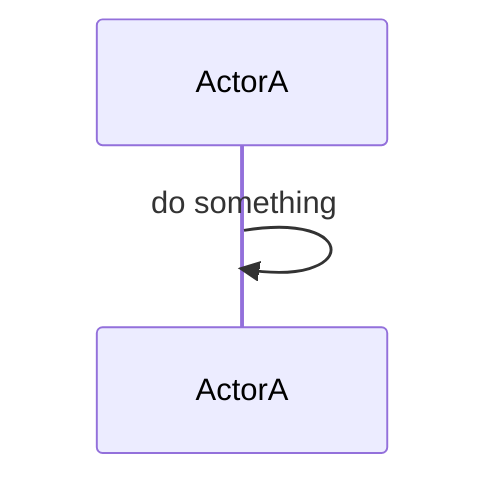

# プロジェクト記事執筆ガイド

`projects/<slug>/index.md` として配置された Markdown が、`app/projects/data.ts` 側で `CONTENT_SLUG_BY_PROJECT` にマッピングされたプロジェクト詳細ページ (`/projects/<プロジェクト slug>`) の「技術詳細」セクションに埋め込まれます。このドキュメントは、レンダリング失敗を避けるために守ってほしい書き方をまとめたものです。

## ファイル配置

- 本文は `projects/<slug>/index.md` に置く
- `<slug>` は英数字と `-` のみ (正規表現: `^[a-z0-9-]+$`)
- タイトルは本文先頭の `# 見出し` が使われる (プロジェクト詳細に埋め込む際は `stripTitle` オプションで自動的に除去される)

## Mermaid 図のルール

Mermaid は `lib/project-content.ts` で下記のようなフェンス内 `mermaid` 言語ブロックを検出して、クライアント側で `app/projects/MermaidRenderer.tsx` がレンダリングします。

<pre>

</pre>

### participant のエイリアスは特殊文字を含むならダブルクォートで囲む

Mermaid のパーサは `participant X as <text>` のエイリアス部分をスペースで区切られたトークンとして解釈します。エイリアスに下記のような文字を裸で書くと構文エラーでレンダリングが失敗します。

- 括弧: `()` `[]` `{}`
- 記号: `#` `::` `:` `,` `;`
- 演算子: `=` `<` `>`

**NG 例 (レンダリング失敗):**

```
participant Loop as Server::startServer()
participant Poll as pollfd[]
participant Ch as #general
```

**OK 例 (ダブルクォートで囲む):**

```
participant Loop as "Server::startServer()"
participant Poll as "pollfd[]"
participant Ch as "#general"
```

英数字と日本語のみのエイリアスはクォート不要です (例: `participant App as アプリ`)。

### 参加者 ID は Mermaid の予約語を避ける

`loop` `alt` `else` `opt` `par` `and` `end` `rect` `note` は Mermaid のブロックキーワードです。参加者 ID として `Loop` のような大文字変種を使うと、実装によっては字句解析で衝突することがあります。衝突しない接尾辞 (`LoopP` など) を付けるか、別名に変えてください。

### arrow 構文

サポートされている矢印は以下です。

- `->>`: 実線 + 実線矢印 (同期呼び出し)
- `-->>`: 破線 + 実線矢印 (応答)
- `-)` / `--)`: 非同期

矢印の後の `:` 以降はメッセージ本文で、ここには基本的にどんな文字も書けます。ただし以下は避けた方が無難です。

- 行頭のバックスラッシュで行継続しようとする
- 改行コード `\n` を文字列として表示したい場合は `\\n` とエスケープする

### alt/loop ブロックは `end` で必ず閉じる

```
loop 説明
    A->>B: do
    alt 条件
        A->>B: branch1
    else 別条件
        A->>B: branch2
    end
end
```

`alt` の内側に `end` を書き忘れると、外側の `loop` の `end` が誤って `alt` の `end` として消費されて壊れます。

### 配色

`app/projects/MermaidRenderer.tsx` でダークテーマ + カスタム `themeVariables` を設定しており、既定でテキストは明るい色で描画されます。新しい要素 (figure など) を追加したときに暗く表示される場合は、`themeVariables` に対応する variable を追加してください。

## Markdown と Mermaid の fence 規則

`lib/project-content.ts` は次の正規表現で mermaid ブロックを抽出します。

```
/```mermaid(?:[^\S\r\n]+[^\n]*)?\r?\n([\s\S]*?)\r?\n```/g
```

守るべき点:

- 開始フェンスは行頭に ` ```mermaid ` を書く (言語名の後ろに属性を付ける場合は空白で区切る)
- 終了フェンスは ` ``` ` のみを行頭に書く
- フェンスの前後には空行を入れる (Markdown パーサの都合で、段落内に埋もれた fence は無視されることがある)
- フェンス内に別の ` ``` ` を入れない

## 動作確認

記事を編集したら、必ずローカルで表示を確認してください。

```bash
npm run dev
# http://localhost:3000/projects/<プロジェクト slug> を開き、下の「技術詳細」を確認する
```

Mermaid 図が表示されない場合は、ブラウザの DevTools → Console を開いて mermaid のパースエラーを確認してください。典型的には `Parse error on line N` のようなメッセージが出ます。

## よくあるトラブル

| 症状 | 原因 | 対処 |
|---|---|---|
| 該当箇所だけ図が出ない | participant のエイリアスに `()` `[]` `#` `::` が裸で入っている | ダブルクォートで囲む |
| すべての mermaid 図が出ない | ` ``` ` の書き忘れ、言語名が `mermaid ` でなく `mermaid-sequence` などになっている | フェンスと言語名を確認 |
| ビルドで `Cannot find module './vendor-chunks/mermaid.js'` | `.next` キャッシュの stale、もしくは mermaid を SSR 側に import している | `rm -rf .next` → `MermaidRenderer` 内で動的 import していることを確認 |
| プロジェクト詳細に技術詳細セクションが出ない | `app/projects/[slug]/page.tsx` の `CONTENT_SLUG_BY_PROJECT` にプロジェクト slug → コンテンツ slug の対応を追加していない | マッピングに 1 行追加する |

## 参考

- Mermaid sequenceDiagram: https://mermaid.js.org/syntax/sequenceDiagram.html
- Markdown ソース: `projects/<slug>/index.md`
- レンダラ実装: `lib/project-content.ts`, `app/projects/MermaidRenderer.tsx`
- プロジェクト詳細ページ: `app/projects/[slug]/page.tsx`
