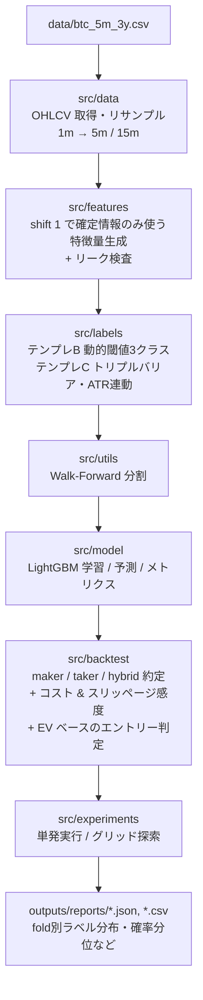

# BTC先物 × LightGBM — 検証基盤としてのトレーディングボット

> 「勝つ戦略」より先に **壊れない検証基盤** を作る、をテーマに設計した
> BTC 先物（5m/15m）向けの機械学習トレーディングパイプライン。
>
> 約3年分の高頻度データで Walk-Forward 検証を回し、
> 60件以上のパラメータ構成で実験。
> 最終的に **PF 3.2 / 勝率 66.7%（5分足・ロングオンリー）** の構成を得た。

## TL;DR

- **目的**: 短期シグナルを LightGBM で生成し、手数料・スリッページを織り込んだバックテストまで一気通貫で回す。
- **データ**: BTCUSDT 先物 5分足 × 約3年（2023-01〜2026-01、315,345 本）。
- **手法**: 動的閾値3クラス（テンプレB）／トリプルバリア3クラス（テンプレC）の2系統を実装し、Walk-Forward で 12〜72 fold 評価。
- **結果**: ロングオンリー × cost_mult=0.10〜0.20 の構成で **PF=3.23 / 12 trades / 勝率 66.7%**。両建ては全構成で PF<1（ショートが利益を喰う）。
- **学び**: 「精度を上げる」より「**ラベルとバックテストの執行ロジックを一致させる**」「**コスト感度を全シナリオで担保する**」方が利益曲線への寄与が大きい。

## なぜ作ったか

短期の機械学習トレード戦略は、再現できないバックテストや未来情報リークによって「論文上は勝つが実運用で死ぬ」が起きやすい領域です。
このプロジェクトの主眼は **「勝つ戦略を見つける」より、「同じ条件で何度でも検証できる基盤」を作ること**。
そのために以下を最優先に置きました。

- 未来情報を一切使わない特徴量パイプライン
- ラベル生成とバックテスト執行ロジックの完全一致（自動テストで担保）
- 手数料・スリッページの感度分析を初手から組み込む
- 設定ファイル駆動で実験を量産可能にする

## 技術スタック

| 領域 | 採用技術 |
|---|---|
| 言語 | Python 3.12 |
| モデル | LightGBM 4.x（multiclass / binary / quantile） |
| データ処理 | pandas 2.x / numpy |
| 設定 | YAML（pyyaml） |
| 評価 | scikit-learn |
| 進捗可視化 | tqdm（fold/特徴量/ラベル生成/バックテスト全段に挿入） |
| テスト | pytest |

## システム全体像



すべてのテンプレートは `make_labels(df, config) -> y, meta` の同一インタフェースで実装されており、ラベル戦略を差し替えても学習・バックテストのコードは変わりません。

## 設計上のこだわり

### 1. リーク防止を「規約」ではなく「テスト」にした

特徴量はすべて `shift(1)` で **その時点の確定情報のみ** を使うルール（`src/features/build.py:33-44`）。
これを徹底するため、以下の自動チェックを `src/features/leakage.py` に置いています。

- 特徴量とラベルのインデックス完全一致
- NaN 比率の異常検知
- 任意の t について `X[t]` の計算に `df[t+1:]` が含まれないことの確認

「リークしないルール」では事故るので、**リーク検出器** を組み込んでテストで落とす設計にしました。

### 2. Walk-Forward 分割（時間順を絶対に崩さない）

`src/utils/time_split.py` で train → valid → test を時間順に区切り、`step_days` 刻みで前進させる構成。
config の例:

```yaml
split:
  method: "walk_forward"
  train_days: 60
  valid_days: 14
  test_days: 14
  step_days: 14
```

3年データ × step=14日で **約72 fold** が生成され、評価サンプルが十分に確保できます。

### 3. トリプルバリア × ATR連動（テンプレC）

固定％の TP/SL ではなく、ATR 倍率で動的に決定:

- 上側バリア: `entry × (1 + u_k × ATR_t / entry)`
- 下側バリア: `entry × (1 − d_k × ATR_t / entry)`
- 垂直バリア: `t + H` バー（時間切れ）

同一バーで TP/SL の両方にタッチした場合、**始値からの距離が近い方を採用** という優先ルールを導入し、ラベル側とバックテスト側の両方で同じ判定を実装しています。

### 4. ラベルと執行ロジックの一致をユニットテストで保証

トリプルバリアで一番事故るのは「ラベル付けと執行のルールがズレて、検証成績だけ良くなる」ケース。
これを `tests/test_label_backtest_consistency.py` で防いでいます。

- `test_template_c_consistency`: 1000 サンプルでラベルとバックテスト判定の一致率を検証
- `test_entry_price_consistency`: 「t のシグナル → t+1 始値で約定」がどちらにも適用されているかを確認

### 5. maker / taker / hybrid の3モード約定

`src/backtest/execution.py` で約定モデルを切り替え可能。`config.execution.mode` を変えるだけで、同じ戦略を別の執行前提で評価できます。

| モード | 概要 |
|---|---|
| taker | 即時約定。コスト高だが滑り損なし。検証ベースライン |
| maker | 指値で待つ。`maker_timeout_bars` 内に刺さらなければキャンセル |
| hybrid | maker 不成立なら taker で追う |

### 6. コスト・スリッページの感度分析を「最初から」入れる

スリッページは事前には分からないので、**シナリオを並列に評価する** 設計に。

```yaml
slippage:
  scenarios: [0.0, 0.00005, 0.00010, 0.00020, 0.00030]  # 0〜3bps
```

「スリッページ0で勝つ」ではなく、「2〜3bps でも生き残る領域があるか」を判断基準にしています。

### 7. EV ベースの損益分岐勝率

`src/backtest/costs.py:164-209` に往復コストと TP/SL 幅から **損益分岐勝率** を計算する関数を実装:

```
required_winrate = (SL幅 + cost_round_trip) / (TP幅 + SL幅)
```

これにより「実績勝率がこの値を超えていないと、いくら統計的に有意でも赤字」という線が引けます。
意思決定ポリシーには `ev_margin_cost_mult` パラメータを設け、`EV > cost × k` を満たす時のみエントリーする EV フィルタを実装。

### 8. 進捗可視化（tqdm）

長時間処理（ラベル生成・fold 学習・バックテスト・グリッド探索）にすべて tqdm を仕込み、ETA と処理速度を表示。
60 fold 級の実験でも放置可能になり、実験回数を稼げました。

## 検証プロトコル

| 項目 | 規模 |
|---|---|
| 設定ファイル数（実験構成） | **62** YAML |
| 実行済み実験レポート | **45** JSON |
| 主な fold 数 | 12（短縮）／ 72（フル） |
| 評価指標 | PF (net) / 勝率 / 総トレード数 / 総PnL / TP率・SL率 / Sharpe / 最大DD |

各実験は `outputs/reports/` に `*_experiment.json`、`*_fold_label_distribution.csv`、`*_fold_proba_analysis.csv` を出力し、ラベル比率と予測確率分布が崩れていないかを fold 単位で追跡できる構成にしました。

## 結果

### 上位構成（PF降順、抜粋）

| Config | PF(net) | Trades | 勝率 | PnL(net) | TP% | SL% | Folds |
|---|---:|---:|---:|---:|---:|---:|---:|
| long_tp15_cost020_relaxed | **3.48** | 8 | 75.0% | +513 | 62.5% | 25.0% | 12 |
| long_tp15_cost010_relaxed | **3.23** | 12 | 66.7% | +623 | 58.3% | 25.0% | 12 |
| long_tp15_cost015_relaxed | 3.02 | 11 | 63.6% | +564 | 54.5% | 27.3% | 12 |
| long_tp14_cost015_relaxed | 2.19 | 4 | 75.0% | +121 | 50.0% | 25.0% | 12 |
| long_tp13_cost010_relaxed | 1.68 | 2 | 50.0% | +50 | 50.0% | 50.0% | 12 |
| 5m mix（両建て） | 0.53 | 3,700+ | 37–40% | -50k〜 | 26–33% | 48–51% | 12 |
| 15m C（両建て） | 0.73 | 2,155 | 39.2% | -32k | 28.7% | 51.8% | 12 |

### TODO10 フルラン（72 folds, ロングオンリー）

| 設定 | Trades | PF(net) | 勝率 |
|---|---:|---:|---:|
| both + cost×0.5（初回） | 3,013 | 0.58 | 39.8% |
| **long only + cost×0.25（フル）** | **236** | **1.014** | **40.7%** |

「短縮ランで PF=3.2 が出た構成」と「フルランで取引機会を増やしてPF=1.01に落ち着いた構成」の両方を残し、**期間が変わってもエッジが保たれるか** を確認できる形にしてあります。

## 知見・学び

### 1. ロングオンリーの方が安定する

ラベル分布が Down 寄り（約60%）に偏り、モデルが Down を過剰予測。両建ては全構成で PF<1。
**ショート側はメタラベリング等の追加工夫が必要** という結論に至りました。

### 2. 閾値の小数第2位が PF を 3 倍動かす

`ev_margin_cost_mult` を 0.30 → 0.20 → 0.10 に動かすだけで、トレード数は数倍、PF は 1.0 → 3.2 へ。
**「微差」と思っていたパラメータが実は支配的** という典型例。これがあるから感度分析を最初から入れる価値があります。

### 3. 5m が 15m より明確に有利

15m はトレード機会が出にくく、出ても PF=0.73 程度。同じパイプラインでも **時間足によってエッジの有無が逆転** することを確認。

### 4. 「トレード数 × 勝率」より「ラベル整合性」が利く

PF 改善の最大要因は、複雑なモデル化よりも **ラベルとバックテストの執行ルール一致** と **コスト見積もりの厳密化** でした。

### 5. 検証基盤の投資は早期に回収される

「リーク検査」「fold ラベル分布出力」「シナリオ並列バックテスト」を先に作ったことで、設定 YAML を増やすだけで実験を量産でき、合計 60 件以上の構成を比較できました。

## 今後の展望

- **ショート側のメタラベリング（テンプレD）** 導入で両建てを再挑戦
- **分位点回帰（テンプレE）** で「危ない局面は触らない」判断を組み込み、最大 DD 改善
- **ファンディングコスト** の組み込み（現状は最大保有 60 分前提で省略）
- 板情報を使った **microstructure 特徴量** の本格化（現状は OHLCV ベースのみ）

## このプロジェクトで示せること

- **時系列機械学習の落とし穴（リーク・分割・約定整合）** を、テストとパイプライン設計で潰すアプローチ
- **設定駆動の実験基盤** を作って 60 件規模の比較を回す再現性
- **取引コスト・スリッページの感度** を最初から評価軸に組み込む現実主義
- **「精度」ではなく「PF と最大DD」で評価する** 取引指標重視のメトリクス設計

> 「勝つコード」より「同じ条件で何度でも検証できる基盤」を組めるか、を意識して作ったプロジェクトです。
