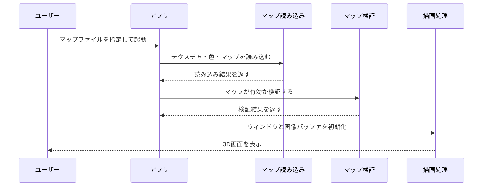
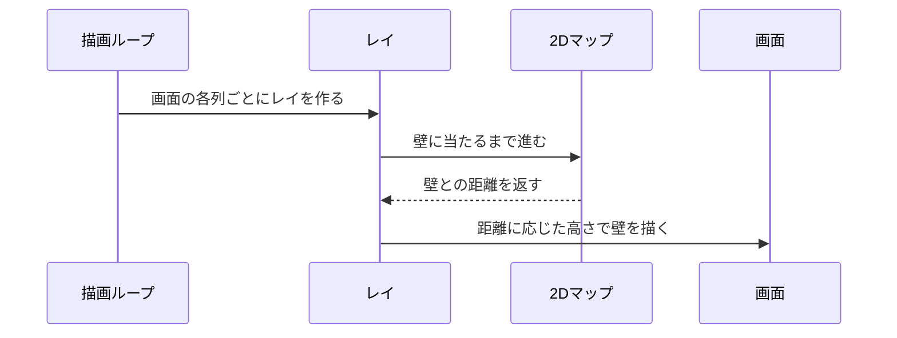

# C言語で2Dマップを3D空間として描画する迷路探索アプリを作った

## はじめに

このプロジェクトでは、C言語を使って一人称視点の3D迷路探索アプリを実装しました。

プレイヤーはキーボードとマウスで移動・視点操作を行い、テキストで書かれたマップファイルをもとに、壁・床・天井・テクスチャ付きの3D空間を探索できます。

一般的な3Dゲームエンジンは使わず、レイキャスティングという手法を使って、2Dのマップ情報から疑似3Dの画面を描画しています。

## 作ったもの

実装した主な機能は以下です。

- テキスト形式のマップファイル読み込み
- 壁テクスチャ、床色、天井色の読み込み
- マップの不正チェック
- レイキャスティングによる3D描画
- キーボードによる移動
- マウスによる視点操作
- 壁との衝突判定
- ミニマップ表示
- エラー処理とメモリ解放

マップファイルを書き換えることで、迷路型、広いホール型、複雑な都市区画型など、複数のマップを切り替えて遊べる構成にしました。

## 使用技術

- C
- MiniLibX
- Makefile
- X11
- XPM画像
- レイキャスティング
- DDAアルゴリズム

MiniLibXは、42の課題でよく使われる軽量なグラフィックライブラリです。

このプロジェクトでは、ウィンドウ作成、画像バッファ作成、ピクセル描画、キー入力、マウス入力、XPM画像の読み込みに使用しています。

## 全体の処理の流れ

アプリ起動時は、まずマップファイルを読み込みます。

その後、マップの正しさを検証し、描画に必要なテクスチャやウィンドウを初期化して、リアルタイム描画ループに入ります。

## マップファイルの読み込み

マップファイルには、壁画像、床色、天井色、マップ本体が書かれています。

例えば、以下のような情報を読み込みます。

- 北・南・東・西の壁に使う画像
- 床のRGBカラー
- 天井のRGBカラー
- 壁、通路、プレイヤー初期位置を表すマップ

マップ本体では、主に以下のような文字を使います。

- `1`: 壁
- `0`: 通路
- `N` / `S` / `E` / `W`: プレイヤーの初期位置と向き

このようにテキストでマップを表現することで、コードを変更せずにステージを追加できます。

## 入力チェックで意識したこと

C言語では、不正な入力をそのまま扱うと、範囲外アクセスやクラッシュにつながりやすくなります。

そのため、マップ読み込み後に以下のような検証を行いました。

- 必要な画像パスがすべて指定されているか
- 画像ファイルの拡張子が正しいか
- 床色・天井色がRGBとして有効か
- マップに使えない文字が含まれていないか
- プレイヤーが1人だけ存在するか
- マップが壁で囲まれているか
- 壁や通路が不自然に分断されていないか

特に重要なのは、マップが壁で完全に囲まれているかどうかです。

レイキャスティングでは、プレイヤー位置から壁に当たるまでレイを進めます。マップに穴があると、壁に当たらず範囲外へ進んでしまい、未定義動作につながる可能性があります。

そのため、外側と通路がつながっていないかをチェックし、安全に描画できるマップだけを受け付けるようにしました。

## 2Dマップを3Dに見せる仕組み

このプロジェクトの中心は、レイキャスティングによる描画です。

レイキャスティングでは、画面の横1列ごとにプレイヤーの視点から仮想的な光線を飛ばします。

その光線が壁に当たるまでの距離を計算し、距離が近ければ壁を高く、遠ければ壁を低く描画します。

これにより、実際には2Dのマップしか持っていなくても、奥行きのある3D空間のように見せることができます。

## DDAアルゴリズム

壁までの距離を求めるために、DDAアルゴリズムを使いました。

DDAは、グリッド状のマップ上でレイが次にどのマスへ進むかを効率よく判定する方法です。

単純に細かい距離で少しずつ進めるのではなく、次に縦線をまたぐか、横線をまたぐかを比較しながら進めるため、無駄な計算を抑えられます。

処理の流れは以下です。

1. プレイヤー位置と視線方向からレイを作る
2. レイが次に進むマスを計算する
3. そのマスが壁かどうかを確認する
4. 壁に当たるまで繰り返す
5. 壁までの距離をもとに描画する高さを決める

この処理を画面の横幅分だけ繰り返すことで、1フレーム分の3D画面を作っています。

## テクスチャ描画

壁に色を塗るだけではなく、XPM画像をテクスチャとして貼り付けています。

レイが壁に当たった位置から、テクスチャ画像のどのX座標を使うかを計算します。

さらに、描画する壁の高さに合わせてテクスチャのY座標を伸縮させることで、近い壁は大きく、遠い壁は小さく見えるようにしました。

また、壁の向きによって使用する画像を変えています。

- 北向きの壁
- 南向きの壁
- 東向きの壁
- 西向きの壁

この仕組みにより、同じマップでも視点方向によって壁の見え方に変化が出ます。

## プレイヤー移動と衝突判定

プレイヤーは、前後左右に移動できます。

移動処理では、単純に座標を更新するのではなく、移動先が壁にめり込まないかを確認しています。

壁との衝突判定では、プレイヤーを点ではなく小さな円として扱いました。

これにより、壁の角に近づいたときでも極端なめり込みを防ぎ、自然に移動できるようにしています。

また、斜め方向や壁沿いの移動でも操作感が悪くならないように、X方向とY方向を分けて移動できるかも判定しています。

## ミニマップ

画面左上にはミニマップを表示しています。

ミニマップでは、マップ全体の壁、通路、プレイヤー位置、プレイヤーの向きを描画します。

特に複雑なマップでは、3D画面だけだと現在位置が分かりづらくなります。

ミニマップを追加することで、探索中の位置関係を直感的に把握できるようにしました。

## メモリ管理

C言語では、確保したメモリを自分で解放する必要があります。

このプロジェクトでは、以下のようなリソースを扱います。

- 読み込んだマップ文字列
- テクスチャパス文字列
- 検証用に拡張したマップ
- 探索済み判定用の配列
- MiniLibXの画像
- MiniLibXのウィンドウ

エラーが起きた場合でも、途中まで確保したリソースを解放して終了するようにしました。

特に、マップファイルの不備は起動直後に発生するため、読み込み途中でエラーになっても安全に終了できる設計を意識しました。

## 工夫した点

### 不正なマップを早い段階で検出する

描画処理に入ってから不正なマップに気づくと、原因の特定が難しくなります。

そこで、起動時の読み込み段階でできるだけ厳密にチェックし、問題がある場合は描画を開始する前にエラーとして終了するようにしました。

### マップ追加をしやすくする

壁画像、床色、天井色、マップ本体を1つのマップファイルにまとめることで、ステージ追加をしやすくしました。

コードを変更せず、テキストファイルを追加するだけで新しいマップを読み込めます。

### デモとして見栄えするマップを用意する

ポートフォリオで見せやすくするため、ミニマップ上でも形が分かりやすいマップを複数作成しました。

例えば、左右対称の大聖堂風マップ、スパイラル状のギャラリーマップ、都市区画風の複雑なマップなどを用意しています。

単に動くだけではなく、初見でも「何を作ったのか」が伝わる見た目を意識しました。

## 学んだこと

このプロジェクトを通して、C言語でアプリケーションを作る上で必要な基礎を広く学べました。

特に学びが大きかったのは以下です。

- ファイル読み込みと文字列解析
- 入力値のバリデーション
- 2D配列を使ったマップ管理
- レイキャスティングによる描画
- ピクセル単位の描画処理
- キーボード・マウス入力
- 衝突判定
- メモリ管理
- エラー時の安全な終了処理

高機能なゲームエンジンを使わずに描画や入力処理を実装したことで、普段はライブラリやエンジンが隠している処理を理解できました。

## まとめ

このプロジェクトでは、テキストで書かれた2Dマップを読み込み、C言語で3D迷路探索アプリとして描画しました。

単に画面に壁を表示するだけではなく、マップ検証、テクスチャ描画、移動、衝突判定、ミニマップ、エラー処理まで含めて実装しています。

低レイヤーな描画処理やメモリ管理を経験でき、C言語での実装力を高める良い題材になりました。
