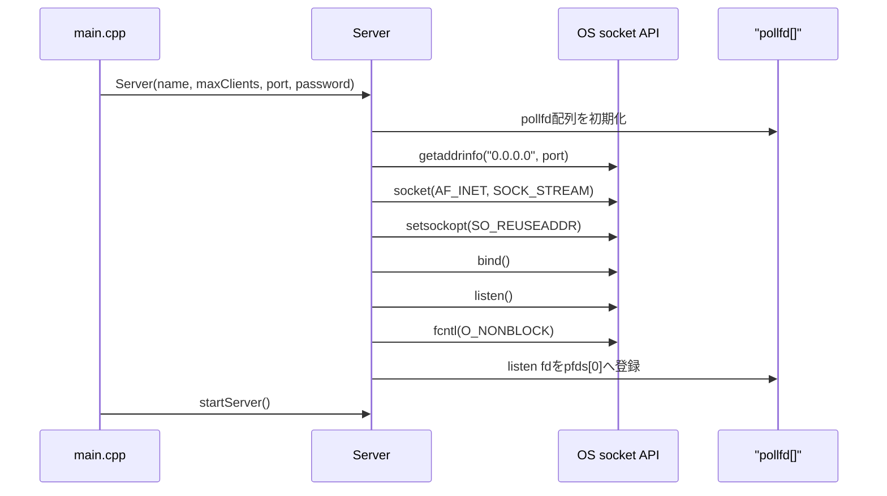
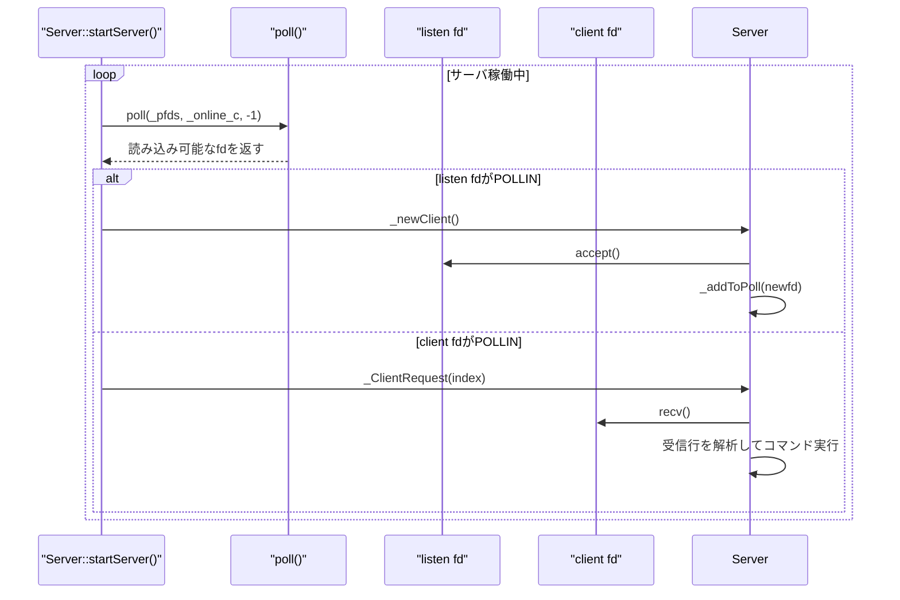
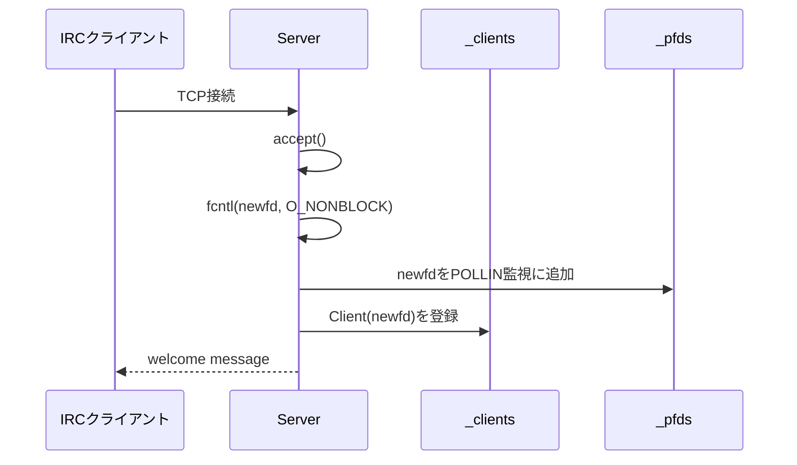
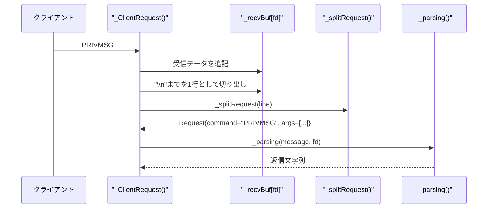
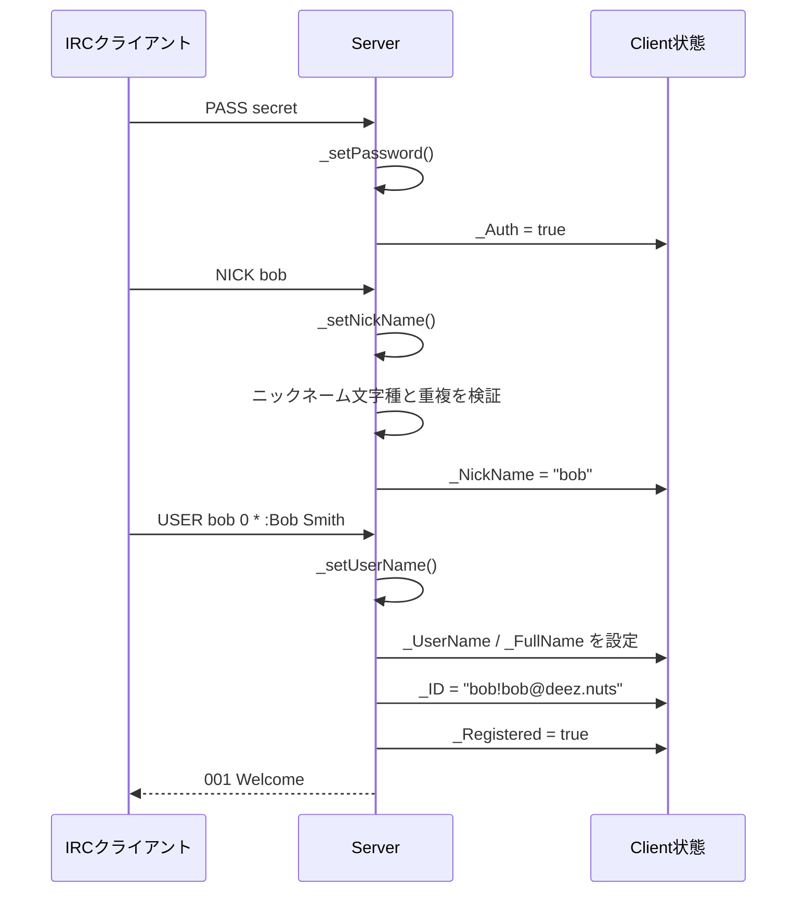
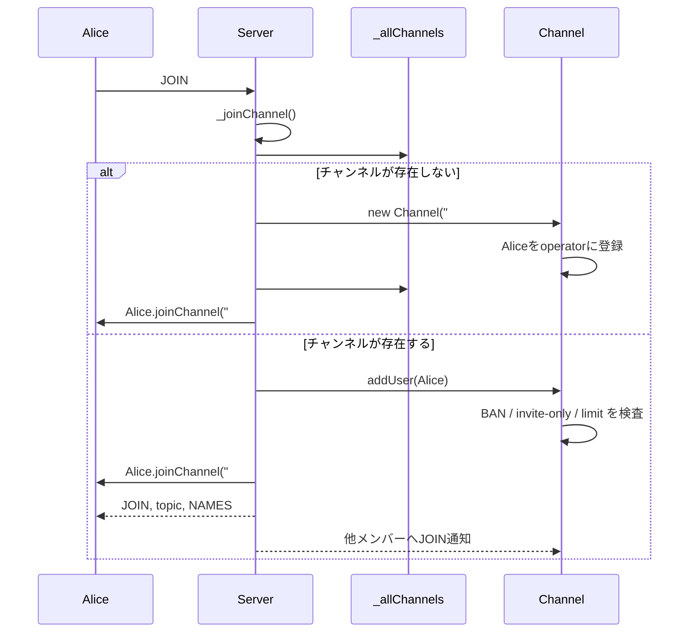
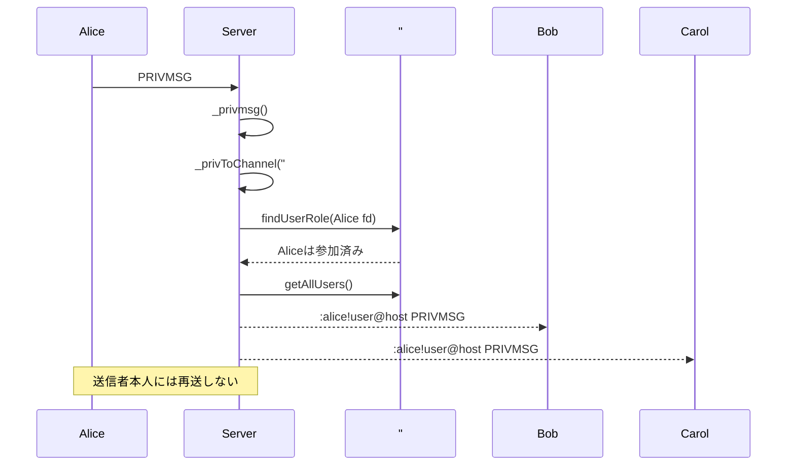
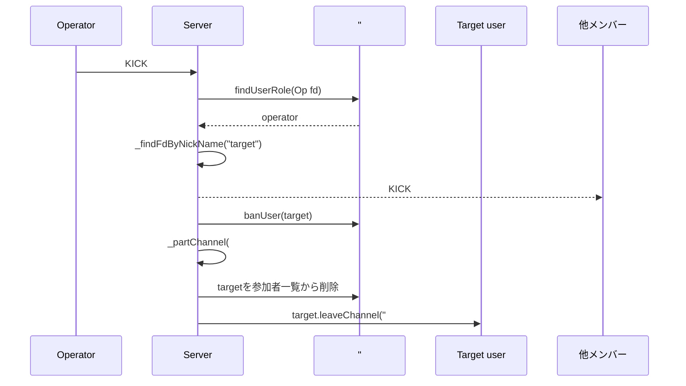
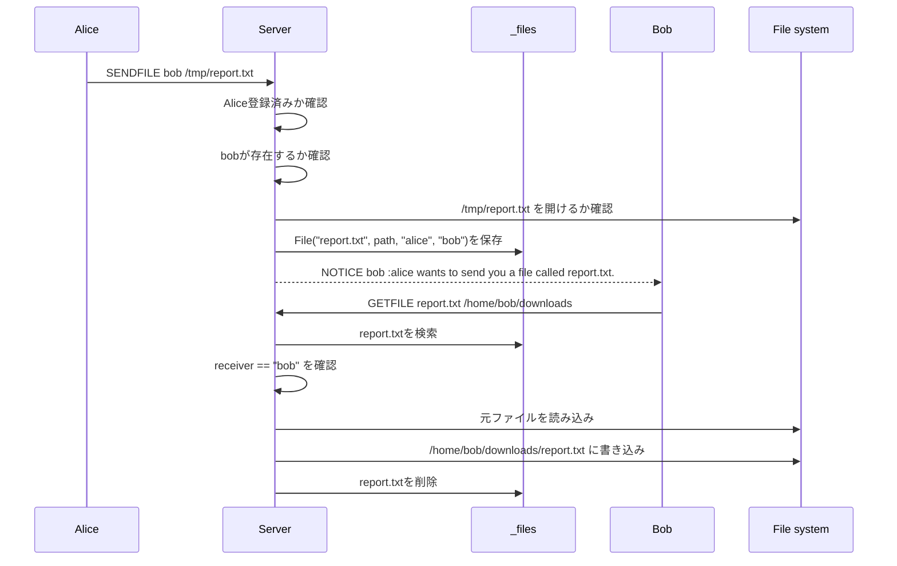
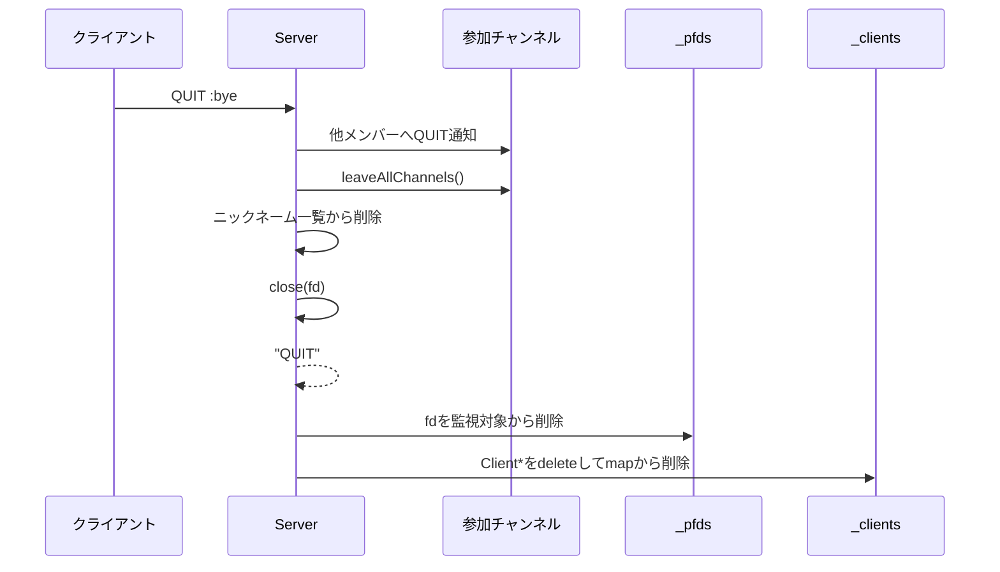

# C++98で作るIRCサーバ: pollとソケットで組み立てるft_irc実装解説

この記事では、C++98で実装したIRCサーバ `ft_irc` の内部構造を、実装の流れに沿って詳しく解説します。

`ft_irc` は、TCPソケットでクライアントを受け付け、IRC風のコマンドを解析し、ユーザー登録、チャンネル参加、メッセージ配送、チャンネル管理、簡易ファイル受け渡しを行うサーバです。実装は大きく分けると、次の責務に分かれています。

- `Server`: ソケット、`poll`、クライアント管理、コマンドディスパッチを担当する中心クラス
- `Client`: 接続中ユーザーの認証状態、ニックネーム、参加チャンネル、ユーザーモードを保持
- `Channel`: チャンネル参加者、オペレーター、トピック、招待制、キー、人数制限などを保持
- `Request`: 受信した1行のコマンドを `command` と `args` に分解した結果
- `File`: `SENDFILE` / `GETFILE` 用のファイルメタデータ

実装言語はC++98です。`std::thread` や高レベルな非同期I/Oライブラリは使わず、POSIXソケットと `poll` を使って複数クライアントを1つのイベントループで扱います。

## 全体像

起動エントリーポイントは `main.cpp` です。

```cpp
Server srv("DEEZ.NUTS", 10, av[1], av[2]);
srv.startServer();
```

サーバ名、最大クライアント数、ポート、パスワードを `Server` に渡し、`startServer()` でイベントループを開始します。

内部では `Server` が次の状態を持ちます。

- `_socketfd`: listen用ソケット
- `_pfds`: `pollfd` 配列
- `_clients`: fdから `Client*` への対応表
- `_allChannels`: チャンネル名から `Channel*` への対応表
- `_recvBuf`: fdごとの受信途中バッファ
- `_files`: ファイル名から `File` への対応表
- `_clientNicknames`: ニックネーム重複チェック用の一覧

ポイントは、クライアントごとにスレッドを作らず、全fdを `poll` で監視していることです。これにより、複数接続を単一ループで処理できます。

## サーバ起動とソケット初期化

`Server` コンストラクタは、`pollfd` 配列を初期化したあと `_getSocket()` を呼びます。

`_getSocket()` の流れは次の通りです。

1. `getaddrinfo("0.0.0.0", Port, ...)` で待ち受けアドレスを作る
2. `socket()` でTCPソケットを作る
3. `setsockopt(..., SO_REUSEADDR, ...)` で再起動時にポートを再利用しやすくする
4. `bind()` でポートに結びつける
5. `listen()` で接続待ち状態にする
6. `fcntl(..., O_NONBLOCK)` でlistenソケットをノンブロッキングにする

起動シーケンスを図にするとこうなります。



`pfds[0]` にはlistenソケットが入り、以降のクライアントfdは `_addToPoll()` で配列に追加されます。

## pollによるイベントループ

`startServer()` は無限ループで `poll()` を呼びます。

```cpp
int pollCount = poll(this->_pfds, this->_online_c, -1);
```

タイムアウトは `-1` なので、何かイベントが起きるまでブロックします。イベント発生後、`POLLIN` が立っているfdを見て、listenソケットなら新規接続、クライアントソケットならリクエスト処理に分岐します。



この構造は、シンプルなイベント駆動サーバの基本形です。各fdに対して「読めるようになったら読む」だけを行うため、1つのクライアントの入力待ちでサーバ全体が止まりにくくなります。

## 新規接続の受け付け

listenソケットに `POLLIN` が立つと `_newClient()` が呼ばれます。

`_newClient()` は `accept()` で新しいfdを取得し、そのfdもノンブロッキングに設定します。その後 `_addToPoll(newfd)` で `pollfd` 配列に登録し、同時に `_clients` に `Client` オブジェクトを追加します。

接続直後にはウェルカムメッセージを送信します。ただし、この時点ではまだIRCユーザーとして登録済みではありません。クライアントは `PASS`、`NICK`、`USER` を送って登録を完了する必要があります。



## 受信バッファと1行単位の処理

IRCのコマンドは基本的に1行単位です。しかしTCPはストリームなので、1回の `recv()` で必ず1コマンドだけ届くとは限りません。

例えば、次のようなことが起こります。

- `PASS secret\r\nNICK bob\r\n` が1回の `recv()` でまとめて届く
- `PRIVMSG #room :hello wor` まで届き、次回 `ld\r\n` が届く
- 複数行の途中で切れる

このため、実装では `_recvBuf[sender_fd]` に受信したバイト列を追記し、`\n` が見つかるたびに1行を切り出して処理します。

```cpp
_recvBuf[sender_fd] += std::string(buf, nbytes);
while ((pos = _recvBuf[sender_fd].find("\n")) != std::string::npos)
{
    std::string message = _recvBuf[sender_fd].substr(0, pos);
    _recvBuf[sender_fd].erase(0, pos + 1);
    std::string ret = _parsing(message, sender_fd);
    ...
}
```

この設計により、TCPの分割・結合に左右されず、アプリケーション層では常に「1行のコマンド」として処理できます。

## Requestへの分解

1行の文字列は `_splitRequest()` で `Request` に変換されます。

`Request` は単純な構造です。

```cpp
class Request {
  public:
    std::vector<std::string> args;
    std::string command;
    bool invalidMessage;
};
```

IRCでは、末尾引数を `:` で始めると空白を含められます。

```text
PRIVMSG #general :hello world
```

この場合、`command` は `PRIVMSG`、`args` は `#general` と `hello world` になります。`_splitRequest()` はこの `:` 以降を1つの引数として扱うことで、メッセージ本文に空白を含められるようにしています。



## コマンドディスパッチ

`_parsing()` は `Request.command` を見て、対応するハンドラへ振り分けます。

代表的な対応は次の通りです。

- `PASS`: パスワード認証
- `NICK`: ニックネーム設定
- `USER`: ユーザー名とフルネーム設定
- `JOIN`: チャンネル参加
- `PRIVMSG`: ユーザーまたはチャンネルへのメッセージ送信
- `NOTICE`: ユーザーへの通知送信
- `MODE`: ユーザーモードまたはチャンネルモード変更
- `TOPIC`: チャンネルトピック参照・変更
- `INVITE`: 招待
- `KICK`: キックとBAN
- `PART`: チャンネル退出
- `QUIT`: 接続終了
- `SENDFILE`: ファイル送信リクエスト
- `GETFILE`: ファイル取得
- `HELP` / `HELPDESK`: ヘルプ表示

実装は大きな `if / else if` で書かれており、C++98の範囲では読みやすい素朴なディスパッチです。

## 登録フロー: PASS、NICK、USER

接続直後の `Client` は未認証・未登録です。

登録状態は大きく2段階あります。

- `_Auth`: `PASS` が成功したか
- `_Registered`: `NICK` と `USER` がそろい、IRCユーザーとして利用可能になったか

`PASS` が成功していない状態では、`NICK` と `USER` は拒否されます。`NICK` と `USER` の両方がそろうと、`Client` にIDが設定され、登録済みになります。

IDは次の形式です。

```text
username!nickname@host
```

実装上は `getUserPerfix()` で次のようなprefixを作り、メッセージ配送に使います。

```text
:nickname!username@host 
```

登録シーケンスは次の通りです。



`NICK` と `USER` の順番は固定ではなく、どちらかが後から来たタイミングで両方そろっていれば登録完了になります。ただし、どちらも `PASS` 成功後である必要があります。

## チャンネル参加

`JOIN` はチャンネル機能の入口です。

```text
JOIN #general
JOIN #private secret
JOIN #a,#b keyA,keyB
JOIN 0
```

実装では、カンマ区切りのチャンネル名を `_commaSeparator()` で分割します。キーが渡されていれば `_createPrvChannel()`、キーなしなら `_createChannel()` に進みます。

チャンネルが存在しない場合は新規作成され、作成者はオペレーターになります。既存チャンネルの場合は、BAN、招待制、人数制限、キーなどを確認して参加させます。



`Channel` は参加者を3種類のmapで管理しています。

- `_operators`: チャンネルオペレーター
- `_members`: 通常メンバー
- `_voices`: voice権限を持つユーザー

`getAllUsers()` はこれらをまとめたmapを返し、チャンネル全体への送信に利用されます。

## PRIVMSGによるメッセージ配送

`PRIVMSG` は、宛先がユーザーかチャンネルかで分岐します。

```text
PRIVMSG bob :hello
PRIVMSG #general :hello everyone
```

宛先が `#`、`&`、`+`、`!` で始まらない場合はユーザー宛てとして `_privToUser()` を呼びます。チャンネル名として扱う場合は `_privToChannel()` に進みます。

ユーザー宛てでは、ニックネームからfdを引き、送信元prefix付きのメッセージを対象fdに送ります。

チャンネル宛てでは、送信者がそのチャンネルに参加していることを確認したうえで、送信者以外の全メンバーへ配送します。



チャンネル配送を担当する `_sendToAllUsers()` は、`Client::getUserPerfix()` でprefixを作ってから、送信者以外に `_sendall()` します。

## チャンネル管理: TOPIC、MODE、INVITE、KICK、PART

チャンネルは参加するだけでなく、状態を変更できます。

### TOPIC

`TOPIC` はチャンネルのトピックを参照または変更します。

- 引数がチャンネル名のみなら現在のトピックを返す
- 新しいトピックが渡された場合は変更する
- `topicRestricted` が有効ならオペレーターだけが変更できる

### MODE

`MODE` はユーザーモードとチャンネルモードの両方を扱います。

チャンネル名から始まる対象、つまり `#room` のような引数であれば `_channelMode()` に進みます。そうでない場合はユーザーモードとして `_setMode()` が処理します。

チャンネルモードでは次のフラグを扱います。

- `+i` / `-i`: 招待制の有効・無効
- `+t` / `-t`: トピック変更をオペレーターに制限
- `+l <limit>` / `-l`: 人数制限
- `+k <key>` / `-k`: チャンネルキー
- `+o <nick>` / `-o <nick>`: オペレーター付与・解除

`+o` では、対象ユーザーを通常メンバーmapから削除してオペレーターmapに移す、またはその逆を行います。

### INVITE

`INVITE` は対象ユーザーをチャンネルに招待します。

処理の条件は次の通りです。

- 実行者が登録済みである
- 対象ユーザーが存在する
- 対象チャンネルが存在する
- 実行者がそのチャンネルに参加済みである
- 実行者がチャンネルオペレーターである
- 対象ユーザーがまだチャンネルに参加していない

条件を満たすと、`Channel::_invitedUsers` に対象ニックネームを追加し、対象ユーザーへ `INVITE` メッセージを送ります。

### KICK

`KICK` はチャンネルオペレーターだけが実行できます。

実装では、対象ユーザーを `banUser()` でBANリストに追加し、その後 `_partChannel()` でチャンネルから外します。そのため、この実装の `KICK` は単なる退出ではなく、再参加も制限する動きになります。

### PART

`PART` はチャンネルからの退出です。対象チャンネルが存在し、実行者が参加していれば、`Channel` 側のmapから削除し、`Client` 側の参加チャンネル一覧からも削除します。



## 簡易ファイル受け渡し

この実装には `SENDFILE` と `GETFILE` という独自コマンドがあります。

`SENDFILE` は、送信者が指定したローカルファイルパスをサーバ側で開けるか確認し、ファイル名、パス、送信者、受信者を `_files` に保存します。その後、受信者に `NOTICE` でファイル送信希望を通知します。

`GETFILE` は、受信者がファイル名と出力ディレクトリを指定し、サーバ側で元ファイルを読み、指定ディレクトリへコピーします。取得後は `_files` から削除されます。



一般的なIRCのDCC送信とは違い、この実装ではサーバのファイルシステム上でコピーを行います。そのため、実運用を意識する場合は、パス検証、権限、サイズ制限、同名ファイル、ディレクトリトラバーサルなどの対策が必要になります。

## 終了処理と切断

クライアントが `QUIT` を送ると `_quit()` が呼ばれます。

処理は次の順番です。

1. 参加中チャンネルの他メンバーへ `QUIT` を通知
2. `Client::leaveAllChannels()` で全チャンネルから離脱
3. `_clientNicknames` からニックネームを削除
4. クライアントfdを閉じる
5. 呼び出し元に `"QUIT"` を返す
6. `_ClientRequest()` 側で `_removeFromPoll()` を呼び、`pollfd` 配列と `_clients` から削除

ネットワーク切断で `recv()` が0以下を返した場合も、fdを閉じて `_removeFromPoll()` します。



## この実装で学べること

`ft_irc` は、ネットワークプログラミングの基本要素がコンパクトにまとまった題材です。

特に学びやすい点は次の通りです。

- `socket`、`bind`、`listen`、`accept` の基本的な流れ
- ノンブロッキングfdと `poll` による複数接続処理
- TCPストリームを行単位プロトコルとして扱うための受信バッファ管理
- コマンド文字列を構造化するパーサ
- fd、ユーザー、チャンネルの対応関係の持ち方
- チャンネル内ブロードキャストの実装
- IRC数値リプライ風のエラー応答
- C++98環境でのリソース管理

一方で、実運用品質のIRCサーバに近づけるなら、次のような改善余地があります。

- `pollfd` 配列の確保と拡張を `new[]` と `realloc()` で混在させない
- `send()` が `EAGAIN` になった場合の送信待ちキューを持つ
- チャンネルが空になったときの破棄方針を決める
- `JOIN` 失敗時の数値リプライを呼び出し元まで返す
- `KICK` とBANを別概念として扱う
- `FileTransfer` のパス検証とサイズ制限を強化する
- `Request` パーサの境界条件をテストで固める
- RFC準拠のコマンド名大文字小文字、prefix、複数宛先、数値リプライを整理する

## まとめ

この `ft_irc` 実装の中心は、`poll` によるイベントループと、fdを起点にした状態管理です。

接続は `Client`、会話の場は `Channel`、受信行は `Request` として表現されます。`Server` はそれらを束ね、ソケットイベントをコマンド実行に変換します。

IRCサーバは一見するとコマンド数が多く複雑に見えますが、分解すると基本は次の繰り返しです。

1. fdからバイト列を読む
2. 改行までを1コマンドとして切り出す
3. コマンドと引数に分解する
4. 現在のユーザー・チャンネル状態を検証する
5. 状態を更新する
6. 必要な相手へ返信またはブロードキャストする

この流れを押さえると、`PASS`、`JOIN`、`PRIVMSG`、`MODE` などの個別コマンドも、同じイベント駆動モデルの上に乗っていることが見えてきます。
