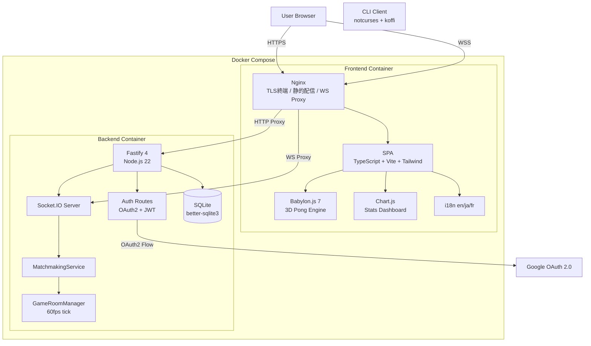
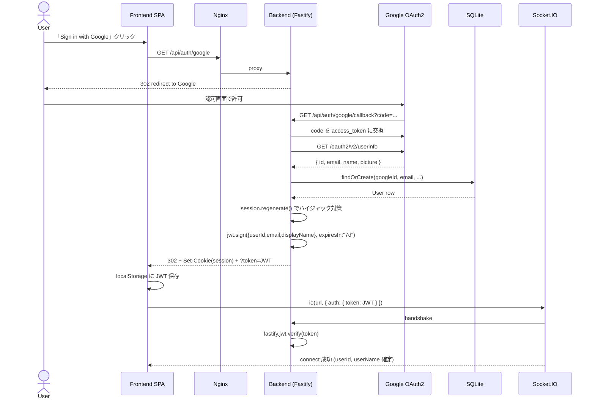
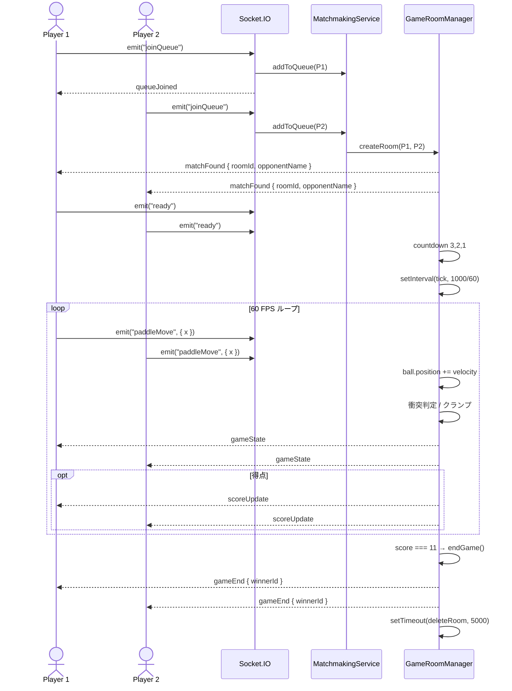
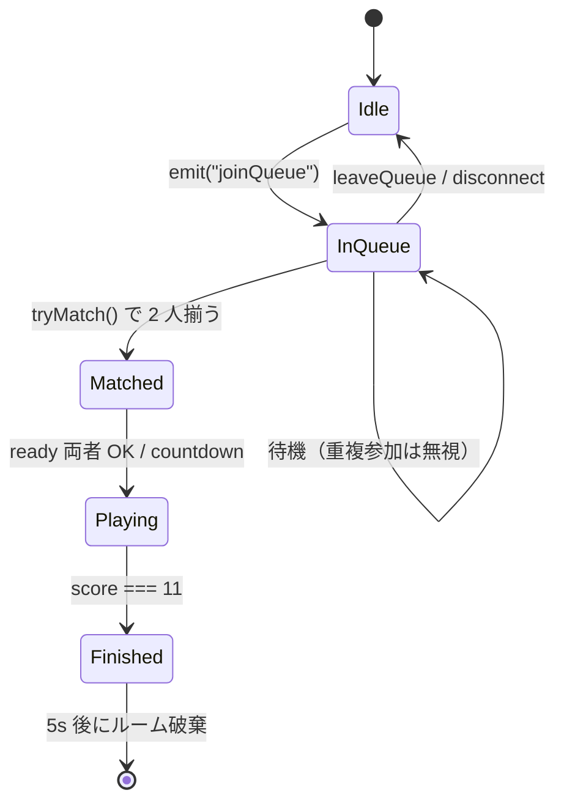
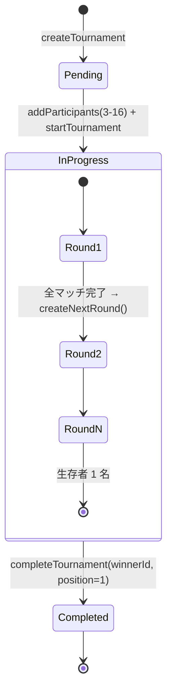
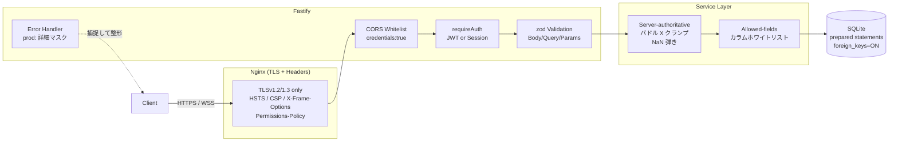
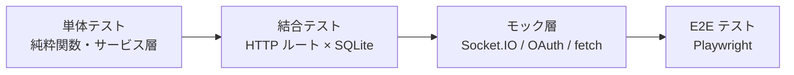

# ft_transcendence を作って学んだこと —— TypeScript モノレポで組む 3D Pong プラットフォーム

> 42 Tokyo の最終課題 `ft_transcendence` を題材に、**4 名のチーム開発** で Fastify + Socket.IO + Babylon.js のリアルタイム対戦ゲームを作ったときの設計判断と実装ディテールをまとめたエントリです。サーバ権威型ゲームループ、OAuth2 + JWT のハイブリッド認証、自前 SPA ルーター、Nginx での TLS / WebSocket 終端など、自分が担当した基盤レイヤーを中心に扱います。

---

## TL;DR

- **モノレポ**: `pnpm workspace` で `packages/{backend,frontend}` + 独立した `cli/`（notcurses + koffi）。
- **バックエンド**: Fastify 4 + `fastify-socket.io` + `better-sqlite3`。**60fps のサーバ権威型ゲームループ**でチート耐性を持たせている。
- **認証**: Google OAuth 2.0（`@fastify/oauth2`）→ **JWT（7日）+ セッション**のデュアル方式。Socket.IO ハンドシェイクは JWT、HTTP API はセッションでも通る。
- **フロント**: Vite + TypeScript SPA、Babylon.js 7 で 3D Pong、Tailwind 3 + 自前 i18n（en/ja/fr）+ 自前ルーター。
- **インフラ**: フロントコンテナの Nginx で TLS 終端 → バックエンドへ HTTP/WebSocket プロキシ。
- **セキュリティ**: 「サーバ権威 / ホワイトリスト / 環境変数」の 3 原則。zod 入力検証、prepared statement、`session.regenerate()`、CSP / HSTS / SameSite Cookie などを多層で重ねる。

---

## 1. システム全景

まず全体像から。フロントとバックは Docker Compose で 2 コンテナに分離し、Nginx が TLS を終端してリバプロする構成です。



ポイントは **「Nginx をフロントコンテナ側に置く」** ところ。これは Render.com にデプロイする際の制約と、TLS 証明書を 1 ヶ所で管理したかったからです（`scripts/generate-certs.sh` が自己署名を吐く）。

---

## 2. 技術選定の理由

| 課題ジャンル | 採用技術 | 採用理由 |
|---|---|---|
| Backend Framework (Major) | Fastify 4 | プラグインアーキテクチャ。`@fastify/oauth2` `@fastify/jwt` `fastify-socket.io` が公式で揃う |
| Database (Minor) | SQLite + `better-sqlite3` | 同期 API でコードが素直、外部サービス不要、Render の永続ディスクに乗る |
| Remote Auth (Major) | Google OAuth 2.0 | パスワード保存不要 → セキュリティ責任の大部分をオフロード |
| Advanced 3D (Major) | Babylon.js 7 | Three.js と比較して TypeScript 親和性とドキュメントの構造化が良い |
| Stats Dashboard (Minor) | Chart.js 4 | 軽量、画像ではなく Canvas、宣言的 API |
| Frontend Toolkit (Minor) | Tailwind 3 | デザインシステムを CSS に書かず、JSX/TSX 不在の素 SPA でも整う |
| Multi-language (Minor) | 自前 i18n | ライブラリ依存を増やさず JSON 3 ファイルで完結 |

「Major 7 個」を最終目標に逆算すると、Backend / OAuth / Remote Players / 3D の **4 Major + Minor 4 個（= 2 Major 換算）** で 6。残り 1 Major は Standard User Management の完成度で取りに行く方針でした。

---

## 3. 認証フロー: OAuth2 → JWT → Socket.IO

ここが一番ハマりました。HTTP リクエストはセッションクッキーで通ってもいいけど、**Socket.IO のハンドシェイクにはクッキーを渡すのが面倒** なので JWT 併用に倒しています。



### 実装で押さえたポイント

1. **`request.session.regenerate()` を必ず噛ませる**  
   Google から戻った瞬間に新しいセッション ID を発行し、Pre-Auth Session Fixation を潰します（`auth.ts:60-83`）。
2. **JWT 有効期限 7 日 / セッション 24 時間（`rolling: true`）**  
   セッションは活動するたびに延長、JWT は固定 TTL。Socket.IO 接続は基本 JWT で、HTTP API は両方を試すデュアル方式（`/api/auth/me`・`/api/auth/status`）。
3. **Socket.IO 認証ミドルウェア**  
   `socket.handshake.auth.token` を優先、無ければクッキーセッションを検証する 2 段構え（`index.ts:156-196`）。本番のクロスドメイン対応で `sameSite: "none"` + `secure: true` にしています。
4. **キュークリーンアップを 30 秒ごと**  
   切断したまま残ったプレイヤーをマッチメイキングキューから掃除する `setInterval`（`index.ts:278-284`）。

---

## 4. サーバ権威型ゲームループ（60fps tick）

オンライン対戦の心臓部。フロントの Babylon.js は **「描画と入力送信」だけ** にし、当たり判定とスコアは全部サーバで計算します。クライアントが送ってくる `paddleMove` の X 座標もサーバ側で必ずクランプ。

### サーバ側のゲームループ



### マジックナンバー帳

| 項目 | 値 | 場所 |
|---|---|---|
| Tick rate | 60 FPS（`TICK_INTERVAL = 1000/60` ≒ 16.67 ms） | `gameRoom.service.ts:307` |
| ボール初速度 | X: `±0.1`, Z: `±0.3` | `gameRoom.service.ts:241` |
| 衝突時の加速 | `velocityZ *= -1.05`（毎ヒット +5%） | パドル衝突ハンドラ |
| スピン | `velocityX = hitOffset * 0.15` | パドル当たり位置依存 |
| フィールド | 幅 20 × 長さ 30、パドル Z = ±12 | `gameRoom.service.ts:371,386` |
| 勝利点 | 11 | `MAX_SCORE` |
| ルーム自動削除 | 終了 5 秒後 | `endGame()` |

### 入力検証の小ネタ

クライアントから来る `paddleMove.x` は信用しません。`Math.max(-FIELD_HALF, Math.min(FIELD_HALF, x))` でクランプし、しかも **「直前の値から 0.01 以上ジャンプしたら警告ログ」** を出してチート / バグ検知の足がかりにしています（`gameRoom.service.ts:279-290`）。

### `endGame()` のレース防止

`gameState` 更新と得点判定は同じ tick の中で起きるので、`endGame()` が二重に呼ばれる可能性がある。これを `if (this.gameEnded) return;` のガード一行で潰します。終了後 5 秒で `setTimeout` してルームを破棄。

---

## 5. マッチメイキング（FIFO）

シンプルな先着順キュー。複雑な ELO レーティングは入れていません（課題的にも要求外）。



`tryMatch()` は **キュー追加直後に毎回走らせる**ので、2 人目が来た瞬間にマッチが成立。`queue.find(p => p.userId === userId)` で重複参加を弾きます（`matchmaking.service.ts:47, 99-100`）。

---

## 6. トーナメント

シングルエリミネーションを 1 トランザクションでブラケット生成。



ポイントは:

- **参加者シャッフル**: `participants.sort(() => Math.random() - 0.5)` で初期ペアリング前にランダム化。
- **奇数人数の bye**: `round` の最後の 1 人を次ラウンドへスルーパス（`tournament.service.ts:334`）。
- **次ラウンド自動生成**: 現ラウンド全マッチ `status === "completed"` を検知して `createNextRound()` 起動（`:281-282`）。
- **トランザクション**: 参加者追加・ブラケット生成は `db.transaction()` で原子化（`:52-79`）。

---

## 7. フロントエンド —— Babylon.js + 自前ルーター + i18n

React も Vue も使っていません。`<div id="app">` に対して **自前ルーター** が `PageInstance.getElement()` を流し込む素の TypeScript SPA です。

### 自前ルーターの最小実装

```ts
interface PageInstance {
  getElement(): HTMLElement;
  destroy?(): void;
}

// router.ts:83-115 抜粋
const dynamicRoutes = [
  { pattern: /^\/tournament\/(\w+)\/play$/, page: TournamentPlayPage },
  { pattern: /^\/profile\/(\w+)$/,           page: ProfilePage },
  { pattern: /^\/game\/online\/(\w+)$/,      page: OnlineGamePage },
];
```

- `<a data-link href="...">` を捕まえて `history.pushState` で SPA 遷移
- `popstate` で戻る・進むに対応
- ページ遷移時に**前ページの `destroy()`** を必ず呼ぶ（Babylon.js シーンや Socket リスナーの解除）

### Babylon.js シーン構築

```ts
// PongEngine.ts 抜粋（イメージ）
const camera = new ArcRotateCamera("cam", -Math.PI / 2, Math.PI / 3, 40, target, scene);
const light  = new HemisphericLight("hemi", new Vector3(0, 1, 0), scene);
const field  = MeshBuilder.CreateBox("field", { width: 20, depth: 30, height: 0.1 }, scene);
const paddle1 = MeshBuilder.CreateBox("p1", { width: 4, depth: 0.5, height: 0.5 }, scene);
const paddle2 = MeshBuilder.CreateBox("p2", { width: 4, depth: 0.5, height: 0.5 }, scene);
const ball    = MeshBuilder.CreateSphere("ball", { diameter: 0.5 }, scene);

engine.runRenderLoop(() => {
  if (mode === "online") {
    // サーバから受信した state を当てるだけ
    applyServerState();
  } else {
    // ローカルモードはクライアント側で物理計算
    updatePhysicsLocal();
  }
  scene.render();
});
```

オンラインモードは **「自分のパドル X だけは即時反映 → サーバから来たフルステートで上書き」** という、いわゆるクライアントサイド予測を弱く入れた構成。ボール位置はサーバ権威。

### キーバインド

| プレイヤー | 左 | 右 |
|---|---|---|
| Player 1（ローカル時） | A | D |
| Player 2（ローカル時） | ← | →（※プレイヤー視点で逆さに見えるので反転）|

モバイル時はタッチボタンが追加されます（`utils/mobile.ts` で UA / viewport 判定）。

---

## 8. Nginx —— TLS 終端と WebSocket プロキシ

`nginx.conf` のキモは 3 つだけ。

```nginx
# 1. TLS
ssl_protocols TLSv1.2 TLSv1.3;
ssl_session_cache shared:SSL:10m;
add_header Strict-Transport-Security "max-age=31536000" always;

# 2. WebSocket（Socket.IO）プロキシ
location /socket.io/ {
    proxy_pass http://backend:3000;
    proxy_http_version 1.1;
    proxy_set_header Upgrade $http_upgrade;
    proxy_set_header Connection "upgrade";
    proxy_read_timeout 86400s;        # 24h: 切断対策
}

# 3. SPA フォールバック
location / {
    try_files $uri $uri/ /index.html;
}
```

`proxy_read_timeout 86400s` を入れているのは、**長時間プレイ中に Nginx が WS をアイドル切断する事故** を防ぐためです（デフォは 60s）。

---

## 9. セキュリティへの取り組み

ゲームと言えど認証・スコア・対戦結果を扱う以上、セキュリティを薄くするとすぐ事故ります。今回は **「サーバ権威」「ホワイトリスト」「環境変数」** の 3 原則を芯にして、HTTP リクエストが届いてから DB に到達するまでの **多層防御** を組みました。

### 防御層の全体像



### 9.1 認証・セッション

OAuth 専一にしてパスワードを保管しない、というのが入口の一番大きな判断です。`bcrypt`/`argon2` の依存を 1 つも入れないことで、**「認証情報の漏洩」というクラスの事故を構造的に消す**狙いです。

```typescript
// index.ts:90-101 抜粋
await fastify.register(session, {
  secret: process.env.SESSION_SECRET || "change-this-secret",
  cookie: {
    secure: process.env.NODE_ENV === "production",
    httpOnly: true,
    maxAge: 24 * 60 * 60 * 1000,                                   // 24h
    sameSite: process.env.NODE_ENV === "production" ? "none" : "lax",
    path: "/",
  },
  saveUninitialized: false,   // 空セッションは作らない
  rolling: true,              // 活動ごとに有効期限リセット
})
```

OAuth コールバックで一番気を使ったのは **セッション再生成**。Pre-Auth セッション ID をそのまま使い回すと固定化攻撃で被害者のアカウントを掴まれる可能性があるので、Google から戻った直後に必ず `session.regenerate()` を噛ませます。

```typescript
// routes/auth.ts:59-83 抜粋
// CRITICAL: Regenerate session to prevent session fixation attacks
await new Promise<void>((resolve, reject) => {
  request.session.regenerate((err) => {
    if (err) return reject(new Error(String(err)))
    request.session.userId      = user.id
    request.session.googleId    = user.google_id
    request.session.email       = user.email
    request.session.displayName = user.display_name
    request.session.save((err) => err ? reject(err) : resolve())
  })
})
```

JWT は **`expiresIn: "7d"`** で TTL を強制 (`index.ts:86`)。HTTP API は「Authorization: Bearer 優先 → セッション フォールバック」のデュアルで通します（`auth.middleware.ts:17-32`）。

### 9.2 WebSocket ハンドシェイク認証

Socket.IO はクッキーに頼らず JWT 必須にしました。コネクション確立時に検証し、**未認証なら即 disconnect** で握り潰します。

```typescript
// index.ts:156-208 抜粋
const token = socket.handshake.auth.token
if (token) {
  try {
    const decoded = fastify.jwt.verify<{userId, displayName}>(token)
    userId   = decoded.userId
    userName = decoded.displayName
  } catch (error) {
    console.log(`[Socket.IO] Invalid JWT token: ${error}`)
  }
}

if (!userId || !userName) {
  socket.emit("error", { message: "Authentication required..." })
  socket.disconnect()
  return
}

socket.data.userId   = userId
socket.data.userName = userName
```

検証後の `userId` は `socket.data` に **サーバ側だけが保管** し、以後の `paddleMove` `ready` `disconnect` 等のイベントは全てこの値で同定します。クライアントから渡される userId は一切信用しません。さらに 30 秒に 1 度のキュークリーンアップ (`index.ts:278-284`) で、切断したまま残ったプレイヤーを掃除します。

### 9.3 サーバ権威 —— チート対策

Pong は単純なゲームですが、**「クライアントを信じるとパドルがフィールド外に飛ぶ」「ボール座標を改竄して常に勝てる」** といったチートの温床です。今回は座標も衝突もスコアも 60 fps の tick で **全部サーバが計算**し、クライアントから来る値は型 → 範囲 → 偏差の 3 段でフィルタしています。

```typescript
// gameRoom.service.ts:265-301 抜粋
updatePaddle(userId: number, x: number): void {
  const room = this.getRoomByPlayer(userId)
  if (!room || !room.gameStarted || room.gameEnded) return

  // CRITICAL: Validate input from client to prevent cheating
  if (typeof x !== "number" || !Number.isFinite(x)) {
    console.warn(`[GameRoom] 🚨 Invalid paddle position from user ${userId}: ${x}`)
    return
  }

  // CRITICAL: Clamp paddle position (server-authoritative)
  const FIELD_WIDTH  = 20
  const PADDLE_WIDTH = 4
  const maxX = (FIELD_WIDTH - PADDLE_WIDTH) / 2     // = 8
  const validatedX = Math.max(-maxX, Math.min(maxX, x))

  // 0.01 超のジャンプは記録（チート検知の足跡）
  if (Math.abs(validatedX - x) > 0.01) {
    console.warn(`[GameRoom] ⚠️ Clamped paddle: ${x.toFixed(2)} → ${validatedX.toFixed(2)}`)
  }
  // ...
}
```

加えて `gameEnded` フラグで `endGame()` の二重起動を防止しています。同 tick 内で複数枝から終了が走る競合を 1 行のガードで潰すパターンです。

### 9.4 SQL Injection 対策

DB アクセスは `better-sqlite3` の **プリペアドステートメント + プレースホルダ `?`** に統一しました。バックエンドの全 SQL（`user.service.ts`、`game.service.ts`、`tournament.service.ts`）を `prepare(...).run(...)` / `.get(...)` / `.all(...)` で書く規約です。

```typescript
// user.service.ts:32-39 抜粋
db.prepare(`
  INSERT INTO users (google_id, email, display_name, avatar_url)
  VALUES (?, ?, ?, ?)
`).run(data.googleId, data.email, data.displayName, data.avatarUrl || null)
```

動的 UPDATE が必要な `updateUser` も、**カラム名のホワイトリスト**で識別子注入を防ぎます。

```typescript
// user.service.ts:127-156 抜粋
const allowedUpdates = ["display_name", "avatar_url"]
const updateFields: string[] = []
const updateValues: any[]    = []

Object.entries(updates).forEach(([key, value]) => {
  if (allowedUpdates.includes(key)) {            // ← 許可リストにある列だけ
    updateFields.push(`${key} = ?`)
    updateValues.push(value)
  }
})
```

LIKE 検索もパターン文字列をパラメータ側に渡し (`searchUsers`)、識別子と値を絶対に混ぜません。`db.pragma("foreign_keys = ON")` を初期化時に明示して、SQLite デフォルト OFF の参照整合性を有効化しています。

### 9.5 入力検証 —— zod を全ルートに

HTTP ルートは **`preHandler` で zod 検証**を必ず噛ませます。

```typescript
// validation.middleware.ts:60-73 抜粋
export const schemas = {
  id:         z.object({ id: z.string().regex(/^\d+$/).transform(Number) }),
  alias:      z.object({ alias: z.string().min(2).max(20).trim() }),
  pagination: z.object({
    page:  z.string().regex(/^\d+$/).transform(Number).optional(),
    limit: z.string().regex(/^\d+$/).transform(Number).optional(),
  }),
}
```

ルート個別にも厳密なスキーマを書きます。`gameType` は enum に縛り、スコアは `int().min(0)`、duration は `positive()`。`ZodError` は全部 `ValidationError`（400）に変換するので、**API 境界で型の不正は必ず弾かれる**保証です。

```typescript
// routes/game.ts:13-28 抜粋
const createGameSchema   = z.object({
  gameType:  z.enum(["local", "online", "tournament"]),
  player1Id: z.number().int().positive().optional(),
  player2Id: z.number().int().positive().optional(),
})
const updateScoreSchema  = z.object({
  player1Score: z.number().int().min(0),
  player2Score: z.number().int().min(0),
})
const completeGameSchema = z.object({
  player1Score: z.number().int().min(0),
  player2Score: z.number().int().min(0),
  duration:     z.number().int().positive(),
})
```

### 9.6 XSS 対策 —— DOM ベースのエスケープ

React/JSX を使わない素の SPA なので、エスケープ責任は自前。**「正規表現置換ミスで穴を開けがち」** という落とし穴を踏まないために、`document.createElement` の `textContent` 経由でブラウザにエスケープを任せる実装にしています。

```typescript
// utils/sanitize.ts
export function escapeHtml(unsafe: string): string {
  const div = document.createElement("div")
  div.textContent = unsafe        // ← ブラウザが自動でエスケープ
  return div.innerHTML
}
export function setTextContent(element, text) { element.textContent = text }
export function setSafeAttribute(element, attr, value) {
  element.setAttribute(attr, escapeHtml(value))
}
export function createSafeImage(src, alt, className?) {
  const img = document.createElement("img")
  img.src = src
  img.alt = escapeHtml(alt)       // alt も必ず escape
  if (className) img.className = className
  return img
}
```

ユーザ生成テキストは `textContent`、属性に流すときは `setSafeAttribute`、画像生成は `createSafeImage` —— と入口を 3 つに固定して、それ以外で `innerHTML` を書かない規約。

### 9.7 Nginx セキュリティヘッダ

Nginx に **CSP / HSTS / X-Frame-Options** など主要ヘッダを集約しました。アプリ層に書き散らさず、TLS 終端と同じ場所で完結させるのが運用上の利点です。

```nginx
# packages/frontend/nginx.conf:71-80 抜粋
add_header X-Frame-Options          "SAMEORIGIN"                       always;
add_header X-Content-Type-Options   "nosniff"                          always;
add_header X-XSS-Protection         "1; mode=block"                    always;
add_header Referrer-Policy          "strict-origin-when-cross-origin"  always;
add_header Permissions-Policy       "geolocation=(), microphone=(), camera=()" always;
add_header Strict-Transport-Security "max-age=31536000; includeSubDomains" always;
add_header Content-Security-Policy
  "default-src 'self';
   script-src 'self' 'unsafe-inline' 'unsafe-eval';
   style-src  'self' 'unsafe-inline' https://use.typekit.net https://p.typekit.net;
   font-src   'self' https://use.typekit.net https://p.typekit.net;
   img-src    'self' data: https:;
   connect-src 'self' https: wss:;
   frame-ancestors 'self';
   upgrade-insecure-requests;" always;
```

| ヘッダ | 効果 |
|---|---|
| **HSTS 1 年 + `includeSubDomains`** | HTTPS ダウングレード防止 |
| **CSP `frame-ancestors 'self'`** | クリックジャッキング対策（X-Frame-Options と二重防御） |
| **CSP `connect-src 'self' https: wss:`** | Socket.IO の WSS だけを通す |
| **CSP `upgrade-insecure-requests`** | HTTP リソース参照を自動 HTTPS 化 |
| **`X-Content-Type-Options: nosniff`** | MIME スニッフィング系 XSS 対策 |
| **`Permissions-Policy`** | カメラ / マイク / 位置情報 API を全部 OFF |
| **`Referrer-Policy: strict-origin-when-cross-origin`** | リファラ漏洩制限 |

### 9.8 TLS / HTTPS

```nginx
# nginx.conf:14-19 抜粋
ssl_protocols TLSv1.2 TLSv1.3;
ssl_ciphers   HIGH:!aNULL:!MD5;
ssl_prefer_server_ciphers on;
ssl_session_cache   shared:SSL:10m;
ssl_session_timeout 10m;
```

TLS 1.0 / 1.1、NULL 認証、MD5 を全部除外。**HTTP 80 番は 301 で HTTPS に強制リダイレクト**（設定ファイル末尾）。Socket.IO も同じ Nginx を経由するので、**WebSocket は必ず WSS** になります。

### 9.9 CORS —— ホワイトリスト

`Access-Control-Allow-Origin: *` を本番で出さないために、環境ごとにホワイトリスト方式。

```typescript
// index.ts:53-75 抜粋
const allowedOrigins = process.env.NODE_ENV === "production"
  ? [
      process.env.FRONTEND_URL || "https://your-frontend-url.onrender.com",
      "https://localhost:8443",
      "http://localhost:8080",
    ]
  : [
      "https://localhost:8443",
      "https://localhost:5173",
      "http://localhost:8080",
      "http://localhost:5173",
      process.env.FRONTEND_URL || "https://your-frontend-url.onrender.com",
    ]

await fastify.register(cors, {
  origin: allowedOrigins.filter(Boolean),     // undefined は除去
  credentials: true,
})
```

Socket.IO サーバにも **同じホワイトリスト** を再適用します（`index.ts:104-110`）。`credentials: true` を付ける以上、ワイルドカードは絶対に出しません。

### 9.10 認可と機密フィールドのフィルタリング

`requireAuth` ミドルウェアが `getUserId()` で JWT / セッションを検証し、認証無しを 401 で弾きます。**公開プロファイル**を返すルートでは `google_id` と `email` を構造分解で除外します。

```typescript
// user.service.ts:162-169 抜粋
getPublicProfile(userId: number) {
  const user = this.getUserById(userId)
  // Remove sensitive information
  const { google_id: _google_id, email: _email, ...publicProfile } = user
  return publicProfile
}
```

`/api/users/` の一覧エンドポイントでも、**返却前にホワイトリストで `id` `display_name` `avatar_url` `created_at` だけに絞る**作りです (`routes/user.ts:53-58`)。

### 9.11 エラーハンドリング —— 情報漏洩を防ぐ

5xx 系エラーで **スタックトレース・内部メッセージを本番で外に出さない** ようにしています。

```typescript
// middleware/error-handler.ts:83-106 抜粋
const errorResponse = {
  error: {
    code,
    // 本番の 5xx は固定文言に差し替え
    message: isProduction && statusCode >= 500
      ? "Internal server error"
      : error.message,
    statusCode,
  },
}

// スタックトレースは開発時のみ
if (!isProduction && error.stack) {
  errorResponse.error.stack = error.stack
}
```

サーバ側ログには常に full details を残しつつ、**外向けレスポンスでは詳細をマスク**するという定石。認証失敗は `"Not authenticated"` `"Invalid session"` のような汎用文言にして、ユーザの存在判定を難しくします。

### 9.12 シークレット管理

- `.gitignore:116-120` で `.env`, `.env.local`, `.env.{development,test,production}.local` を全パターン登録
- リポジトリには `.env.example` のみコミット、**コメントで `openssl rand -hex 32` を案内**
- `JWT_SECRET` / `SESSION_SECRET` / `GOOGLE_CLIENT_SECRET` を全部環境変数経由（`index.ts:81-91`、`routes/auth.ts:13-14`）
- ハードコードされたシークレットなし（フォールバック値 `"change-this-secret"` は dev only と明示）

### 9.13 データベーススキーマレベルの制約

```sql
-- config/database.ts より抜粋
CREATE TABLE IF NOT EXISTS users (
  id          INTEGER PRIMARY KEY AUTOINCREMENT,
  google_id   TEXT UNIQUE NOT NULL,    -- ← 重複登録不可
  email       TEXT UNIQUE NOT NULL,
  ...
);
CREATE TABLE IF NOT EXISTS game_sessions (
  ...
  game_type   TEXT CHECK(game_type IN ('local','online','tournament')) NOT NULL,
  FOREIGN KEY (player1_id) REFERENCES users(id),
  ...
);
```

- `UNIQUE` 制約で `google_id` `email` の重複を DB 側で禁止
- `CHECK` 制約で `game_type` を 3 値に縛る
- 外部キー + `pragma foreign_keys = ON` で参照整合性を強制

---

## 10. テスト戦略

リアルタイム対戦と OAuth が絡むコードベースは、**手で触ってデバッグする**だけでは安心して触り続けられません。**単体 → 結合 → モック → E2E** の 4 層でテストを重ねています。



### 単体テスト

- 対象: `services/*.service.ts` のビジネスロジック、`utils/sanitize.ts` のエスケープ、トーナメントブラケット生成（`generateBracket` / `createNextRound`）など。
- 方針: **副作用ゼロの純粋関数化**できる部分を切り出してから書く。`Math.random` をスタブ可能にしたうえでブラケットの決定性をテスト。

### 結合テスト

- 対象: Fastify の HTTP ルートを `fastify.inject()` で叩き、テスト用の **インメモリ SQLite**（`new Database(":memory:")`）に対して **prepared statement 込みの実 SQL** を流す。
- 検証: zod バリデーション、`requireAuth` の 401、`createTournament → addParticipants → start` の状態遷移、レスポンス形のスナップショット。

### モック層

- **Google OAuth**: `googleapis.com/oauth2/v2/userinfo` への `fetch` をモックして、`findOrCreate` が呼ばれることを検証。
- **Socket.IO**: `socket.io-mock` 系のスタブで `joinQueue → matchFound`、`paddleMove → opponentPaddleMove` のイベント往復を確認。
- **時間**: `setInterval` のゲームループは fake timers でステップ実行し、tick あたりの状態遷移を観測。

### E2E テスト（Playwright）

- 起動: `docker-compose up` した状態の HTTPS 開発環境（`https://localhost:8443`）に対して走らせる。
- 主要ジャーニー:
  1. **ローカルトーナメント**: 4 人参加 → 全試合プレイ → 優勝者表示
  2. **オンライン対戦**: 2 ブラウザコンテキストで同時にキューに入る → `matchFound` → 試合完了 → ダッシュボードのスタッツ更新
  3. **OAuth ログイン**: モック OAuth プロバイダ経由で `/api/auth/google/callback` まで通す
  4. **i18n**: 言語切替で全ページのテキストが en/ja/fr に追従
- アーティファクト: 失敗時にスクリーンショット・動画・トレース（`trace.zip`）を `playwright-report/` に保存し、CI でアップロード。
- 並列化: 各テストでブラウザコンテキストを分離しクッキー / `localStorage` を独立化。**JWT を localStorage に書く** 構成なので、コンテキスト分離は必須でした。

### 何が嬉しかったか

- **回帰の自動検知**: パドルクランプ（`gameRoom.service.ts:283`）や `session.regenerate()` のようなセキュリティ寄りの実装は、人間レビューで気づきにくい一方で **テストなら必ず壊れる**。
- **リファクタの安心感**: マッチメイキングを FIFO から優先度キューに変える検証なども、結合テストがあるおかげで小刻みに進められる。
- **CI でのスクショ証跡**: Playwright のトレースがあると、Render 環境でしか出ない描画バグの再現が圧倒的に楽。

---

## 11. ハマりどころと学び

実装を通して刺さった棘たち：

1. **Socket.IO に Cookie で認証させようとして詰んだ**  
   → `auth: { token }` で JWT を渡す方式に切り替え。クライアントから `localStorage` の JWT を Socket 初期化時に渡すだけで済む。
2. **`session.regenerate()` を忘れていた**  
   OAuth コールバック直後にセッション ID を再発行しないと、攻撃者が事前に取得した Pre-Auth セッション ID で被害者の認証セッションを乗っ取れる。
3. **`endGame()` の二重呼び出し**  
   60fps の tick 内で「得点判定 → endGame」が同 tick に複数枝で起こる。`gameEnded` フラグで guard。
4. **パドル X クランプはサーバ必須**  
   クライアントを信じるとフィールド外まで動くチートが容易に書ける。送られてきた値も必ずサーバ側で `Math.max/min` でクランプ。
5. **Babylon.js のシーン破棄忘れ → メモリリーク**  
   ページ遷移時に `engine.dispose()` を呼ばないと WebGL コンテキストが残り続ける。`PageInstance.destroy()` で確実に解放。
6. **Nginx の `proxy_read_timeout` を伸ばす**  
   既述。デフォ値だと 1 分間入力がない瞬間に WS が切れる。
7. **i18n は素の JSON で十分だった**  
   `i18next` を入れる前に「en/ja/fr の 3 ファイル + `t(key)` 関数」でやり切れた。依存ゼロ最高。

---

## 12. これから手を入れたいところ

- **AI Opponent**: ローカル 1P モードに学習なしのルールベース AI を入れる予定。
- **CLI Pong**: `cli/` に notcurses + koffi の足場まではあるが、サーバとの実通信はまだ。
- **アクセシビリティ強化**: ハイコントラストモード、キーボードフォーカス可視化など。

---

## まとめ

ft_transcendence は **「フルスタック × リアルタイム × グラフィクス」** が一気に来る課題なので、技術選定で外すと完成しません。今回の構成 —— Fastify でサーバを薄く保ち、Socket.IO ハンドシェイクは JWT に倒し、ゲームロジックは 60fps の **サーバ権威ループ** に集約、フロントは Babylon.js + 自前ルーターの素の SPA —— は、**「フレームワーク依存を最小化しつつスケジュールに収める」** という観点では悪くない着地でした。

特にサーバ権威型ゲームループは、書く前は「重そう」と思っていたのに、書いてみると **`setInterval(16.67ms)` で物理を回し、`gameState` を broadcast するだけ** で、想像以上に短く堅実な実装になります。チート対策・レース防止・タイムアウト、そして **入力検証 → 認証 → DB アクセス** の多層防御を貫けば、Pong レベルなら堅実に動きます。

42 の同期生でこれから触る人の参考になればうれしいです。質問や指摘があれば気軽にどうぞ。

---

### 参考: 主要ファイル

```
packages/backend/src/
├── index.ts                        # サーバ起動 + Socket.IO 認証 (299 行)
├── routes/{auth,game,tournament,user}.ts
├── services/
│   ├── gameRoom.service.ts         # 60fps tick / 物理 (540 行)
│   ├── matchmaking.service.ts      # FIFO キュー (139 行)
│   ├── tournament.service.ts       # ブラケット生成 (393 行)
│   ├── game.service.ts             # ゲーム CRUD (265 行)
│   └── user.service.ts             # OAuth findOrCreate (204 行)
└── middleware/{auth,validation,error-handler}.ts

packages/frontend/src/
├── main.ts / router.ts             # SPA エントリ + 自前ルーター (158 行)
├── game/PongEngine.ts              # Babylon.js シーン (556 行)
├── services/{api,auth,game,socket,tournament}.service.ts
├── pages/{Home,Dashboard,Game,OnlineGame,Tournament*,Profile,...}.ts
└── i18n/{en,ja,fr}.json
```
