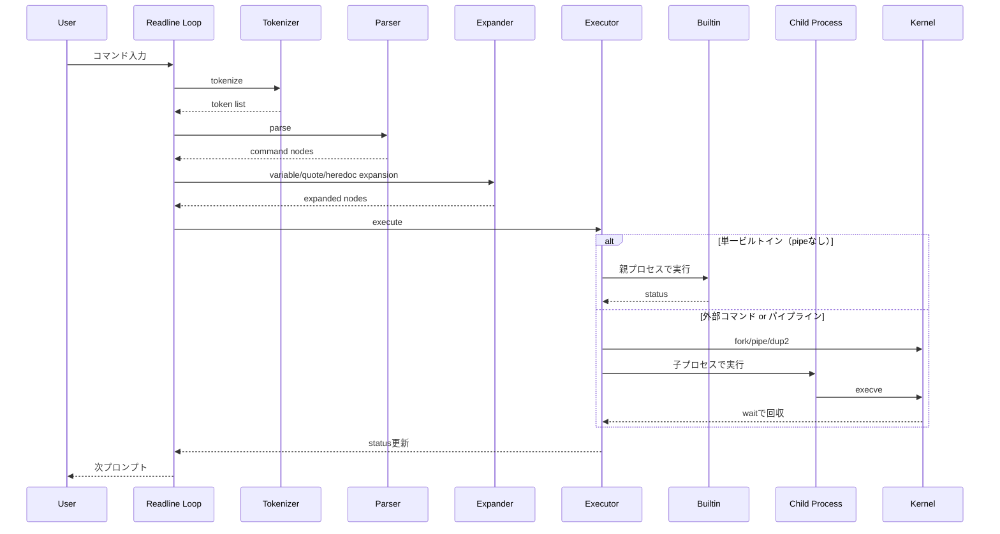

# minishell実装記: C言語でBash風シェルを組み立てる

## はじめに

42 Tokyoの課題として、Unixシェルの主要機能をC言語で再実装した。目的は、コマンド実行の表面的な再現ではなく、字句解析・構文解析・展開・実行制御までを一貫して理解し、プロセス/FD/シグナルの扱いを実装で体得することだった。

本記事では、minishellの設計方針と実装上の難所、実際に行った工夫をまとめる。

## プロジェクト概要

- 期間: 2024年11月
- 体制: 2人開発
- 言語: C
- 主な使用API: fork, execve, wait/waitpid, pipe, dup2, open/close, signal/sigaction
- ライブラリ: GNU Readline

対応した主な機能:

- パイプライン実行
- リダイレクト（<, >, >>）
- heredoc（<<）
- 環境変数展開（$VAR, $?）
- ビルトイン（cd, echo, env, exit, export, pwd, unset）

## 要件に対する設計方針

実装初期に、処理責務を次の4段階に明確化した。

1. Tokenizer: 入力文字列をトークン列へ変換
2. Parser: トークン列をコマンドノード列へ変換
3. Expansion: 変数展開と語分割、リダイレクト先の展開
4. Executor: ビルトイン/外部コマンドを適切なプロセス文脈で実行

この分離により、「どの層で何を確定させるか」が明確になり、デバッグと仕様修正の影響範囲を小さくできた。

加えて、設計レビュー時に次の原則を共有して実装ぶれを減らした。

- 文字列処理は可能な限りTokenizer/Expansionに寄せ、Executorは実行責務に専念する
- 例外系（不正トークン、open失敗、execve失敗）は早期にstatusへ反映する
- 1コマンド実行後にFD状態を復元し、次ループへ副作用を持ち越さない

## 処理フロー（シーケンス図）



## モジュール別の実装ポイント

### 1. Tokenizer

入力文字列を走査し、word / operator / redirection / pipe をトークン化する。クォートの扱いをここで崩さないことが重要で、後段の展開処理へ意味を渡す役割を持つ。

実装上のポイント:

- 空白スキップ
- クォート文字列の一括取り込み
- 演算子・リダイレクト記号の種別化
- 構文エラー時にstatus=2へ統一

詳細:

- `|`, `<`, `>`, `>>`, `<<` を明示的に識別してトークン種別を付与
- 以降の処理で意味が変わらないよう、クォート文字を含む語の境界を保持
- 不正文字や想定外トークン列を検知した時点で、残り入力を打ち切って次プロンプトへ戻す

### 2. Parser

トークン列からコマンドノード列を生成する。パイプでノードを分割し、各ノードに引数列とリダイレクト情報を保持する。

実装上のポイント:

- `|`を境界にノードを連結
- リダイレクトは「演算子 + ファイル名」を1セットで検証
- `|`終端や不正トークンを検出して早期エラー

詳細:

- ノードは単方向連結だけでなく前後参照を持ち、パイプ準備時に隣接ノードへアクセスしやすくした
- `>`の直後がさらにリダイレクト記号であるような不正列を明示検出
- 構文エラー時はNode生成を中断し、後段実行に進ませない

### 3. Expansion

パース済みノードに対して、変数展開と語分割を適用する。クォート有無で展開可否を切り替えることが挙動再現の要点だった。

実装上のポイント:

- `$VAR`, `$?` の展開
- シングルクォート内は展開しない
- ダブルクォート内は一部展開する
- 未定義変数と空文字の扱いを分離
- heredocで引用状態に応じた展開ON/OFF

詳細:

- 引数トークンとリダイレクト先ファイル名で展開ルールを分離
- 語分割前後でトークン列を作り直し、展開による引数個数変化に対応
- 未定義変数が未引用で単独語の場合に空語化されるケースをフラグで管理

### 4. Executor

実行フェーズは「親で実行すべきもの」と「子で実行すべきもの」の判定が最重要。

実装上のポイント:

- pipeなし単一ビルトインは親プロセスで実行
- それ以外はforkして子プロセス側で実行
- パイプ時はdup2で標準入出力を接続
- waitで終了ステータスを回収し、最終statusを更新

詳細:

- パイプ実行前に全ノード分のpipeを準備し、親子双方で不要FDを確実にclose
- 子プロセスではシグナル設定をデフォルトへ戻し、外部コマンド実行時の挙動差を抑制
- 最後のコマンドPIDを基準に終了ステータスを決定し、シェルのstatusへ反映

## 内部データ構造

実装の中核は次の3構造体で、責務を明確に分けた。

- Token: 文字列、種別、展開状態、未定義変数フラグ
- Node: 引数列、リダイレクト列、パイプ情報、前後ノード参照、PID
- Env: key/valueを持つ連結リスト

この構造により、Parserまでは構文情報中心、Executorでは実行情報中心と関心を分離できた。

## ミニ文法の捉え方

厳密なBash互換文法を実装する代わりに、課題要件に対して次の最小構文モデルを置いた。

- command_line = command (pipe command)*
- command = word* redirection*
- redirection = (< | > | >> | <<) word

このモデルを採用したことで、実装とテストケースの対応関係を作りやすくなり、境界ケースの洗い出しが進んだ。

## 難所と解決策

### 難所1: ビルトインの実行文脈

課題:

- `cd`, `export`, `unset`, `exit` は親プロセス状態に影響する
- すべて子で実行すると、環境更新が反映されない

解決:

- 「単一ビルトインかつpipeなし」の場合のみ親で直接実行
- それ以外は子プロセス側に寄せるルールへ統一

効果:

- 状態更新系ビルトインの挙動安定
- 実行フローの分岐条件が明確になり保守しやすくなった

### 難所2: FD復元漏れ

課題:

- リダイレクト適用後に標準入出力を戻し忘れると、次コマンドへ副作用が残る

解決:

- 対象FDを事前退避（stash）し、実行後に必ず復元（reset）
- 失敗時のclose/dup2エラーパスを追加

効果:

- 実行単位ごとの入出力独立性が向上
- 再現しづらい不具合の発生頻度を低減

### 難所3: heredocとSIGINT

課題:

- 通常プロンプトとheredoc入力中ではCtrl+C時の期待挙動が異なる

解決:

- readlineのevent hookを活用し、状態ごとに監視処理を切り替え
- heredocループではSIGINT検知時に入力を中断して復帰

効果:

- 対話性が改善し、ユーザー期待に近い挙動へ近づいた

## エラー処理と終了ステータス方針

シェル全体の一貫性のため、エラー分類ごとに終了ステータスの方針を決めた。

- 構文エラー: 2
- 実行不可（権限/存在しないコマンドなど）: 実行結果に応じて反映
- シグナル終了: 128 + signal番号

また、エラー出力は可能な限り「minishell: コマンド名: 詳細」の形式に寄せ、利用者が原因を追いやすいようにした。

## メモリ管理方針

対話型プログラムではリークの蓄積が致命的になるため、1ループごとの解放単位を明確化した。

- 1ループごとにline, token list, node listを解放
- 終了時にenv listとreadline historyを解放
- 異常終了パスでも最小限のリソース解放を通るように統一

この方針により、長時間操作時のメモリ増加を抑え、障害調査時にも解放責務を追いやすくなった。

## 動作確認で重視した観点

- 複数段パイプでのデータ受け渡し
- リダイレクトの優先とエラー伝播
- heredocの終端一致と展開条件
- 未定義変数、空引数、クォート境界
- シンタックスエラー時のstatus整合

実際には次のような観点で回帰確認を行った。

- 機能観点: builtin単体、外部コマンド単体、混在パイプ
- 例外観点: ファイルopen失敗、存在しないコマンド、権限不足
- 入力観点: 空行、連続空白、クォート不一致、連続リダイレクト
- 状態観点: export/unset後の環境反映、終了statusの更新

確認の粒度を「正常系」「境界値」「失敗系」に分けることで、修正時の抜け漏れを減らした。

## 代表的なデモコマンド

```sh
export NAME=Minishell
echo Hello $NAME
echo "one two three" | tr " " "\n" | wc -l
echo logline > demo.txt
cat < demo.txt
cat << EOF
value is $NAME
EOF
unset NAME
echo $NAME
```

## 成果

- シェル実装の中核フロー（tokenize -> parse -> expand -> execute）を一貫して自作できた
- プロセス/FD/シグナル/エラーハンドリングをまたぐ設計と実装経験を得た
- 「仕様に近づけるための責務分離」と「不具合を減らすための例外経路設計」の重要性を体感できた
- チーム開発での設計共有（責務境界・命名・エラー方針）を通じ、実装速度とレビュー効率を上げられた

## 今後の改善案

- 自動テストの拡充（回帰テストの整備）
- エラーメッセージの互換性向上
- 実行器の責務分割をさらに進め、可読性と拡張性を向上
