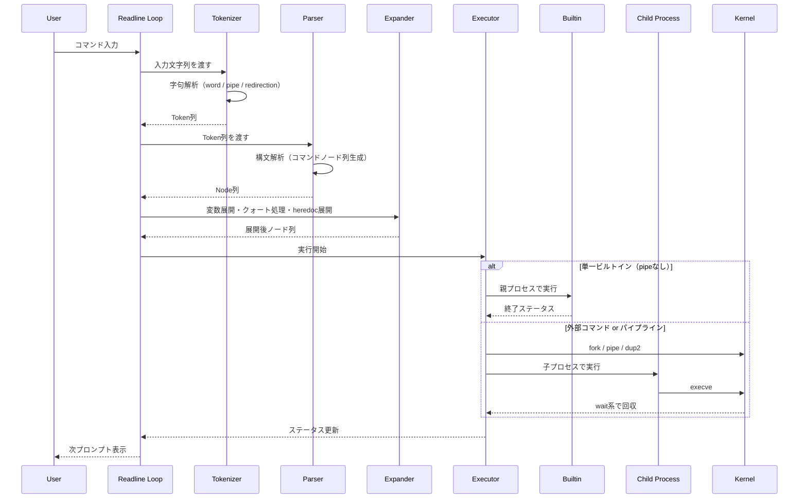

# Minishell Sequence Diagram

以下は、ユーザー入力から実行完了までの代表的な処理フローです。

## Notes

- パイプライン時は各ノードに対してforkし、FDをdup2で接続して実行する。
- pipeなしの一部ビルトインは親プロセスで実行し、環境変更を保持する。
- シンタックスエラー時は解析段階で終了し、実行には進まない。

## ポートフォリオ用にプロジェクト概要

### 期間

2024年11月（42 Tokyoのminishell課題期間）

### 役割

- 2人チームでの共同開発
- 字句解析・構文解析・展開・実行のパイプライン設計
- heredoc、リダイレクト、パイプ処理の実装
- ビルトインコマンド（cd / echo / env / exit / export / pwd / unset）の実装・検証

### 使用技術

- C言語
- POSIX API（fork, execve, wait, pipe, dup2, open, close, signal, sigaction）
- GNU Readline
- Makefile
- Linux環境での動作検証

### 課題と工夫

- 課題: 親プロセスで状態を更新すべきビルトイン（cd, export, unset, exit）と、子プロセスで実行すべき外部コマンドの責務分離が難しかった。
    工夫: 「pipeなし単一ビルトインは親で実行」「それ以外はforkして実行」というルールを明確化し、実装を整理した。
- 課題: heredoc中のシグナル処理と通常プロンプト時の挙動差分の吸収。
    工夫: readlineのevent hookを活用し、通常時とheredoc時で監視関数を切り替えてCtrl+Cの挙動を制御した。
- 課題: リダイレクト適用後の標準入出力復元漏れによる副作用。
    工夫: 対象FDを退避して実行後に復元するフローを統一し、パイプライン実行時も整合性を保つようにした。

### 成果

- 入力から実行までの一連フロー（tokenize -> parse -> expand -> execute）を自作実装できた。
- パイプ、リダイレクト、heredoc、環境変数展開、主要ビルトインを統合したシェルを完成させた。
- プロセス制御、ファイルディスクリプタ、シグナル、エラー処理の理解を実装レベルで深めることができた。
