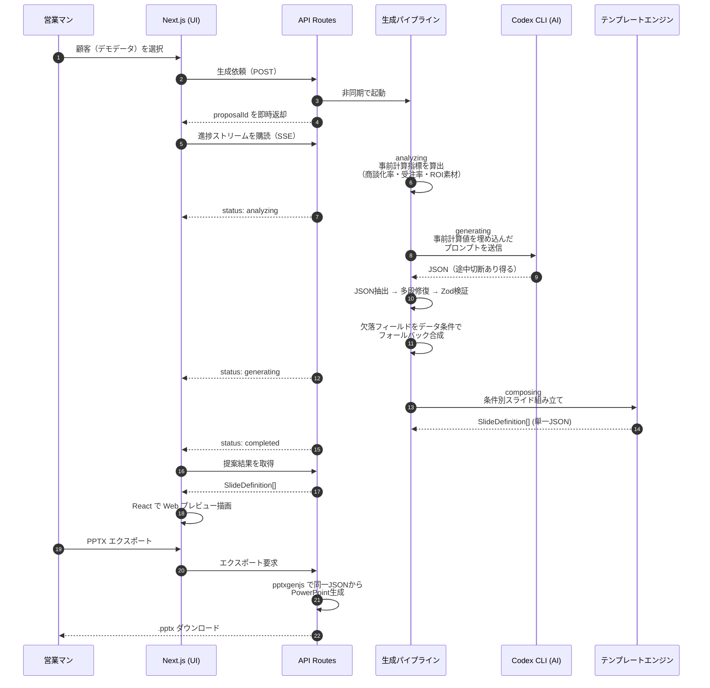
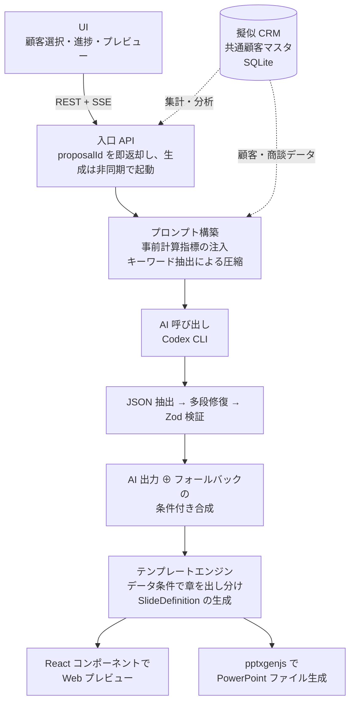

# インサイドセールス × AI スイート — 提案資料自動作成エンジン主軸

商談ヒアリングデータから、クライアントごとに**スライド構成が動的に変化する**営業提案書を自動生成するアプリケーション。AI に数値を「考えさせる」のではなく、**コードで事前計算した正確な指標をプロンプトに注入**し、Web プレビューと PowerPoint を**同一の構造化 JSON から二系統レンダリング**することで、属人化していた営業提案書作成を分単位の作業に置き換える。

> 本プロジェクトはインサイドセールスの全工程（架電 → 育成 → 商談後フォロー → 提案 → 戦略立案 → 育成フィードバック）を **6 つのデモアプリと擬似 CRM** でカバーするスイートとして実装した。最も時間をかけた **Demo 04「提案資料自動作成」を主軸**としつつ、他 5 デモも独立アプリとして実装し、擬似 CRM に蓄積したデータをデモ 05 のターゲティング戦略立案などで集計・分析する設計を組み込んでいる。

## 0. プロダクト全体像

営業代行会社が「インサイドセールスの全工程を AI で再構築する」体験をデモ可能にするため、6 デモ＋擬似 CRM を 1 リポジトリで実装した。各デモは独立して起動可能だが、**擬似 CRM のデータベース（node:sqlite）を共通顧客マスタとして参照**するため、同じ企業を別デモから別の角度で扱える構造になっている。

| # | デモ名 | 解く課題 |
|---|--------|----------|
| 01 | 架電リスト自動生成 | 今日かけるべき顧客を AI が朝イチで自動生成 |
| 02 | リードナーチャリング自動化 | 不通の瞬間にお役立ちコンテンツが自動で届く |
| 03 | 商談後メール自動化 | 商談終了 30 秒後にサンクスメールを下書き作成 |
| **04** | **提案資料自動作成** | ヒアリングメモから提案スライドを自動生成（**本ポートフォリオの主軸**） |
| 05 | ターゲティング戦略立案 | 蓄積した商談データから次に狙う顧客像を導出 |
| 06 | テレアポ育成フィードバック | 全通話を AI が採点し改善レポートを自動作成 |

### 擬似 CRM（共通顧客マスタ）

管理コンソールから、6 デモが共通で参照する SQLite ベースのランタイム DB を運用できる。これにより各デモが「孤立したダミー画面」ではなく、**1 つの顧客が複数の業務フローで連続的に扱われる**営業の現実を再現している。Demo 05 のターゲティング戦略立案では、**擬似 CRM に蓄積した商談データを業種・予算帯・受注確度で集計・分析**し、「次に狙うべき顧客像」を導出する経路まで含めている。

- 商談データ（200 件のリアル風シナリオ）
- 架電リードとスコアリング結果（Demo 01）
- シグナルベースの顧客・担当者マスタ（Demo 02・05）
- 管理 UI: seed 投入、レコード CRUD、データセット世代管理

## 1. 解こうとした課題（Demo 04 主軸）

営業代行会社における提案資料作成は、

- **1 件あたり数時間**かかり、商談直後のスピード感を損なう
- ベテランと新人で**品質に大きな差**が出て、組織にノウハウが残らない
- **業種・課題・予算ごとのカスタマイズ**を毎回ゼロベースでやっている

という構造的なボトルネックを抱えていた。「AI に丸投げで提案書を書かせる」アプローチは数値ハルシネーションと体裁崩れで実用に耐えないため、**「AI に任せる範囲」と「コードで保証する範囲」を境界線で切り分ける設計**が要点になる。

## 2. アプローチの全体像



## 3. 設計上の意思決定（ここが肝）

### 3.1 「数値はコードで計算、文章は AI で生成」の境界線

AI に数値を計算させると、商談化率・受注率・ROI が容易に幻覚を起こす。そこで**プロンプト構築時に決定論的な計算をコードで済ませ**、結果を「算出済み指標（引用可）」として AI に渡す設計に倒した。

```ts
// プロンプト構築フェーズで決定論的に算出して埋め込む
const convRate = ((monthlyAppts / monthlyLeads) * 100).toFixed(1)
lines.push(`- 商談化率: ${convRate}%（月間商談${monthlyAppts}件 ÷ 月間リード${monthlyLeads}件）`)
```

プロンプト末尾には「データに根拠がない数値は使用しない／根拠がない場合は『導入後に測定』と記載」という**禁止ルール**を明記。AI には「数値の選定」ではなく「文脈に合わせた言い回しと構成」だけを担当させる。

### 3.2 トランスクリプトの全量投入を避ける「キーワード優先抽出」

商談文字起こし全文をプロンプトに乗せるとコストとレイテンシが爆発する。**決裁・予算・期限・課題に関するキーワードを含む発言を優先抽出**し、上限 10 ターンに圧縮してから渡す。

```ts
const keywordPattern = /予算|費用|コスト|期限|いつまで|決裁|承認|課題|目標|KPI|商談|受注|件数/
const importantTurns = transcriptTurns.filter(t => keywordPattern.test(t.text))
```

「重要発言が見つからなければ先頭 10 ターンにフォールバック」する保険付き。会話データがゼロではなく薄い場合にも提案書の品質が崩れない。

### 3.3 AI 出力 JSON の多段修復戦略

Codex CLI の長文出力は **JSON が途中で切断される事故**が現実に起きる。これに対して 3 段階のリカバリを実装した。

| 戦略 | 内容 |
|------|------|
| ① boundary 検出 | 文字列リテラル / エスケープを正しく追跡しながら `{` の対応を取り、JSON 範囲を確定 |
| ② `closeAndComplete` | 末尾の未閉じ文字列を補完、不完全な `"key":` ペアを `null` 化、開いている `[` `{` を末尾に補充 |
| ③ `cutToLastSafePoint` | 直近の `}` `]` `,` まで切り戻してから ② を適用 |

3 戦略を順次試し、どれかが Zod 検証を通過すれば成功。**「AI が半分壊れた出力を返しても、提案書は成立する」**ことを保証している。

### 3.4 データ条件によるスライド可変構成

「常に 8 枚の固定構成」ではなく、**入力データに含まれる情報に応じてスライドの有無を動的決定**する。

```ts
// 生成パイプライン側：データ条件を見て、AIが落としたフィールドだけ
// 「フォールバック値で埋める／そもそも出さない」を判定する
const hasCompetitors = opportunity.decisionProcess.competitors.length > 0
const hasTimeline    = Boolean(opportunity.timeline.pilotStartDate)
const hasBudget      = opportunity.budget.min > 0

content = {
  competitiveAdvantages: aiContent.competitiveAdvantages ?? (hasCompetitors ? fb.competitiveAdvantages : undefined),
  roi:                   aiContent.roi                   ?? (hasBudget      ? fb.roi                   : undefined),
  roadmap:               aiContent.roadmap               ?? (hasTimeline    ? fb.roadmap               : undefined),
  ...
}
```

```ts
// テンプレートエンジン側：undefined のセクションは存在しないものとしてスライドから除外
content.competitiveAdvantages?.length ? buildCompetitiveSlide(...) : null,
content.roadmap?.length              ? buildRoadmapSlide(...)      : null,
content.caseStudy                    ? buildCaseStudySlide(...)    : null,
```

**競合がいなければ差別化スライドは出ない。タイムラインがなければロードマップは出ない。**営業現場で「データがないのに無理やり書かれた章」が一番信頼を毀損するため、出さない判断をコードで担保する。

### 3.5 Web プレビューと PowerPoint の単一ソース化

`SlideDefinition` という座標系つきの中間 JSON を**単一ソース**とし、

- React コンポーネントで HTML プレビューを描画
- `pptxgenjs` で同じ JSON を PPTX に変換

の二系統に分岐する。レイアウト崩れが起きないよう、フォントは Noto Sans JP に統一し、座標は両系統で共有。「画面で見えていたものと違う pptx が出てくる」事故を構造的に排除している。

## 4. データ構造の堅牢性

AI が返す JSON は信用しない前提で、**Zod スキーマで厳格に検証**してからスライドに渡す。バリデーションに失敗した時点でフォールバックに切り替えるため、UI に壊れたスライドが描画されることがない。

```ts
const proposalContentSchema = z.object({
  challenges:        z.array(challengeSchema).min(1),
  proposalSummary:   z.string().min(1),
  expectedEffects:   z.array(effectSchema).min(1),
  roi:               roiSummarySchema.optional(),
  roadmap:           z.array(roadmapPhaseSchema).optional(),
  caseStudy:         caseStudySchema.optional(),
  // ...
})
```

## 5. 成果

| 観点 | Before | After |
|------|--------|-------|
| 1 案件あたりの作成時間 | 数時間 | **60 秒以内**（AI 生成のタイムアウト上限） |
| 提案品質 | 担当者依存・品質ばらつき大 | テンプレ＋スコアリングで均一化 |
| ノウハウ蓄積 | 担当者の頭の中 | プロンプト・テンプレ・スコアリング規則として**コード化** |
| 数値の正確性 | 手計算ミス・記憶違い | 事前計算した値のみを引用 |

200 件のリアル風デモデータが組み込まれており、業種・規模・予算帯の異なる顧客を選ぶたびに**スライド構成と内容が動的に変化**する様子をライブで見せられる。

## 6. 設計上のトレードオフ

- **Codex CLI を採用したことによる遅延**: レイテンシは 30〜60 秒オーダー。チャット応答ではなく「商談直後のバッチ生成」というユースケースに振り切った前提で許容。
- **デモアプリとしての永続化省略**: 履歴ストアは in-memory（`Map`）で、サーバ再起動で揮発する。これは MVP の意思決定であり、ミニ CRM 連携時に DB 化する想定（要件 F-06/F-08 として明示）。
- **対応ブラウザを Chrome 最新版に限定**: デモ用途のため互換性検証コストを意図的に切った。

## 7. 技術スタック

| レイヤー | 採用技術 |
|---------|---------|
| AI 生成 | Codex CLI（バックエンドからシェル実行） |
| プロンプト設計 | TypeScript で動的構築・事前計算指標注入・キーワード優先抽出 |
| バリデーション | Zod（AI 出力を 100% 検証してから採用） |
| スライド中間表現 | 自社定義 `SlideDefinition` JSON（Web/PPTX で共有） |
| Web プレビュー | React 19 + Next.js 16 (Turbopack) |
| PowerPoint 生成 | pptxgenjs |
| 進捗配信 | Server-Sent Events |
| 擬似 CRM | node:sqlite + 管理 UI |

## 8. モジュール構成（概念図）


